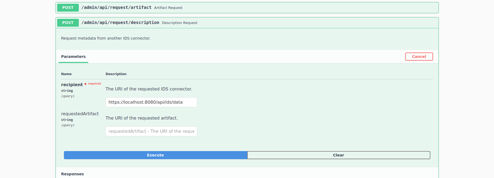
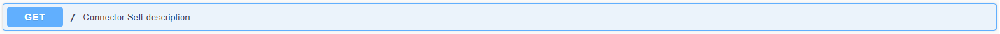
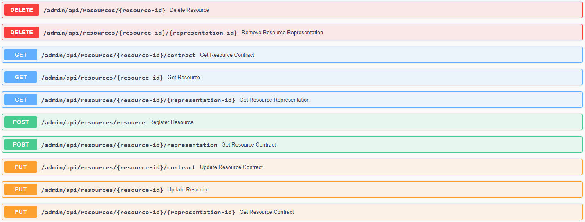
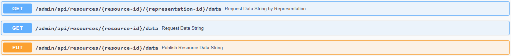
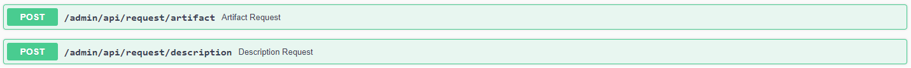
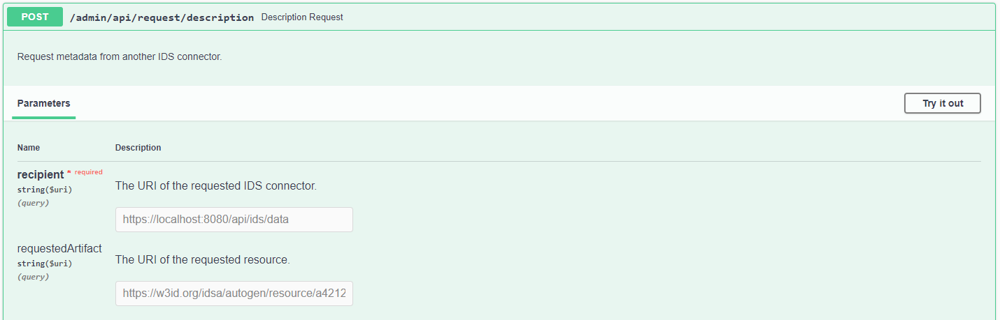
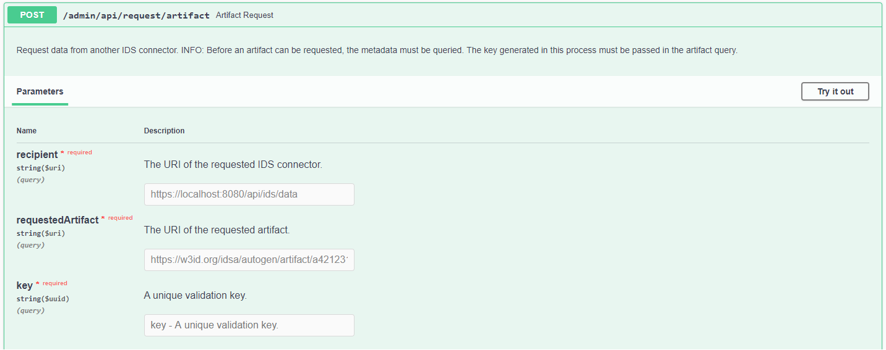
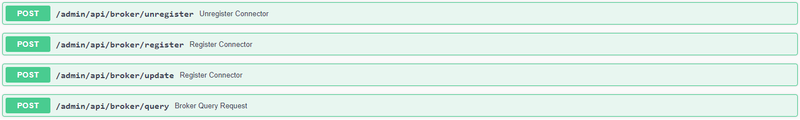

# Dataspace Connector

**Contact**: [Julia Pampus](mailto:julia.pampus@isst.fraunhofer.de)
| **Issues**: Feel free to report issues in this repository using the menu item `Issues` or write an [email](mailto:julia.pampus@isst.fraunhofer.de).
| **Contributing**: See more [details](#contributing).

This is an IDS Connector using the specifications of the [IDS Information Model](https://github.com/industrial-data-space/InformationModel) with integration of the [IDS Framework](https://gitlab.cc-asp.fraunhofer.de/fhg-isst-ids/ids-framework) for connector configuration and message handling.
It provides an HTTP API for loading, updating, and deleting simple data resources with data and its metadata, persisted in a local H2 database. Next to the internal database, external HTTP REST endpoints as data sources can be connected as well.
The connector supports IDS conform message handling with other IDS connectors and IDS brokers and implements usage control for eight IDS usage policy patterns. 

## Content
 
- [Features](#features)  
    - [Technologies](#technologies)  
    - [IDS Components](#ids-components)  
- [Getting started](#getting-started)  
    - [Java Setup](#java-setup)  
    - [Docker Setup](#docker-setup)  
- [Hands-on IDS Communication](#hands-on-ids-communication)  
    - [Providing Data](#providing-data)  
    - [Consuming Data](#consuming-data)  
    - [IDS Broker Communication](#ids-broker-communication)  
    - [Usage Control](#usage-control)  
- [Example Setup](#example-setup)  
- [Development](#development)  
    - [Configurations](#configuration)  
        - [Proxy](#proxy)  
        - [Authentication](#authentication)  
    - [Deployment](#deployment)  
        - [Maven Build](#maven-build)  
        - [Docker Setup](#docker-setup)  
        - [Run Tests](#run-tests)  
    - [Backend API](#backend-api)  
- [Contributing](#contributing)  
    - [Changelog](#changelog)  
    - [Issues](#issues)  
    - [Labels](#labels)  
    - [Branches](#branches)  
    - [Commits](#commits)  
    - [Versioning](#versioning)  
- [FAQ](#faq)  
    - [Connector Deployment](#connector-deployment)  
    - [Resource Handling](#resource-handling)  
    - [IDS Communication](#ids-communication)  
    - [Other](#other)  
- [License](#license)

## Features

This is a list of currently implemented features, which is continuously updated.

*  Settings for TLS, proxy and Spring Boot basic authentication for backend endpoints
*  Use valid IDS certificate and request DAT from DAPS
*  Data resource registration (CRUD metadata) with internal H2 database
*  Backend data handling internal (CRUD data) with internal H2 database
*  Backend data handling external with example Rest Api (external spring boot application with H2 database)
*  IDS message handling with other IDS connectors (as data provider and data consumer): description request/response, artifact request/response, rejection message
*  Read IDS response messages: save requested data & metadata in internal database
*  IDS message handling with the IDS broker (IDS lab): available/update, unavailable, query 
*  Usage control with ODRL policies
*  Possibility to add multiple representations (different backend connections) to a resource

### Technologies

`Java`, `Maven`, `Spring Boot`, `Rest`, `OpenAPI`, `Swagger`, `SLF4J`, `Docker`, `JSON(-LD)`

### IDS Components

| Library/Component | Version | License | Owner | Contact |
| ------ | ------ | ------ | ------ | ------ |
| IDS Information Model | 4.0.0 | Apache 2.0 | Fraunhofer IAIS | [Sebastian Bader](mailto:sebastian.bader@iais.fraunhofer.de) |
| IDS Information Model Serializer | 4.0.0 | Apache 2.0 | Fraunhofer IAIS | [Sebastian Bader](mailto:sebastian.bader@iais.fraunhofer.de) |
| IDS Framework | 3.2.1 | Apache 2.0 | Fraunhofer ISST | [Steffen Biehs](mailto:steffen.biehs@isst.fraunhofer.de) |
| IDS Broker | 	4.0.0 | not open source | Fraunhofer IAIS | [Sebastian Bader](mailto:sebastian.bader@iais.fraunhofer.de) |
| DAPS | 2.0 | not open source | Fraunhofer AISEC | [Gerd Brost](mailto:gerd.brost@aisec.fraunhofer.de) |


## Getting started

At first, clone the repository: `git clone https://gitlab.cc-asp.fraunhofer.de/fhg-isst-ids/dataspace-connector.git`.

If you want to deploy the connector yourself, follow the instructions of the [Development Section](#development). If you do not want to build the connector yourself and just want to see how two connectors communicate, go to the folder `test-setup`. 
Both test setups provide a connector as a data provider, one as a data consumer, and a separated h2 database with an HTTP API running inside an additional spring boot application.

### Java Setup

Extract the provided `java-setup.zip` file. Make sure you have Java 11 installed and both `.jar` files inside their own folder. 
The data provider will be running at https://localhost:8080 and the consumer at https://localhost:8081.

For requesting data from the provider, open the Swagger UI of the consumer (https://localhost:8081/admin/api with `admin` + `password`) and send a request as shown below. 
Due to the missing requested resource, the self-description of the provider is returned in response. To request a specific resource, it has to be created in the provider first.
A more detailed explanation can be found at [Hands-on IDS Communication](#hands-on-ids-communication).



### Docker Setup 

Extract the provided `docker-setup.zip` file. Make sure you have Docker Compose installed and run `docker-compose up` inside the extracted folder. 
In doing so, the provided `.jar` files will be built up as Docker Images and started as a data provider running at http://localhost:8080/ and a data consumer running at http://localhost:8081/.

For requesting data from the provider, please remind that all applications are running inside isolated docker containers. So don't request e.g. http://localhost:8080/api/ids/data but http://provider:8080/api/ids/data.


## Hands-on IDS Communication

To interact with the running application, the provided [endpoints](#backend-api) at the Swagger UI can be used. In the following, it is explained how to provide data with a connector (from internal and external database) and how to consume this from another one.

First of all, the connector provides an endpoint for requesting its self-description. 
The self-description is returned as JSON-LD string and contains several information about the running connector instance. This includes e.g. the title, the maintainer, the Information Model version, and the resource catalog.



### Providing Data

For adding resources to the running connector as data provider, have a look at the following steps.

**Step 1: Register Data Resources to the Connector**

The endpoint `POST /admin/api/resources/resource` can be used for registering resources at the connector. This can be done by providing some important information as metadata in JSON format. An example will be explained in the following.

```
{
  "title": "Sample Resource",
  "description": "This is an example resource containing weather data.",
  "keywords": [
    "weather",
    "data",
    "sample"
  ],
  "owner": "https://openweathermap.org/",
  "license": "ODbL",
  "version": "1.0"
}
```

The values `title`, `description`, `keywords`, `owner`, `license`, and `version` describe the data resource and will be used to fill in the IDS Information Model attributes for IDS communication with a connector as data consumer.

If the resource was successfully registered, the endpoint will respond with the uuid of the created data resource.
The endpoints `PUT`, `GET`, and `DELETE` `/{resource-id}` provide standard CRUD functions to read, update, and delete the metadata, respectively the data resource.

As a resource contains the metadata of a raw data string, it can contain several representations that are used to setup a connection to the internal database or an external backend system.
By default, each resource must have at least one representation. Further details will be explained in Step 3.
A representation can be added by using the endpoint `POST /admin/api/resources/representation`. See this example:

```
{
  "type": "json",
  "byteSize": 105,
  "sourceType": "http-get",
  "source": {
    "url": "https://samples.openweathermap.org/data/2.5/weather?lat=35&lon=139&appid=439d4b804bc8187953eb36d2a8c26a02",
    "username": "-",
    "password": "-",
    "system": "Open Weather Map API"
  }
}
```

The attributes `type` and `byteSize` give detailed information about the data source. The `sourceType` and `source`
contain details for the data providing connector how to retrieve the data from connected backend systems or existing APIs (as Open Weather in the example).

As for the resources, several endpoints provide CRUD operations for representations.



Further endpoints as `PUT` and `GET` `/contract` can be used to add and update the usage policy of a resource without having to update the whole metadata model.
Since the IDS policy language is rather complicated and it is not trivial to create a valid policy by hand, endpoints are provided to obtain example policies (`POST /example/usage-policy`) 
or to validate created strings (`POST /example/policy-pattern`).

**Step 2: Add Data to the Internal Database**

For adding plain data to the registered resource, take the returned uuid and upload a string with `PUT /{resource-id}/data`.
With `GET`, the same endpoint can be used to request the data (hint: always the first representation will be loaded). The endpoint
`/{resource-id}/{representation-id}/data` can be used to request a specific representation of a resource, if multiple have been created.



**Step 3: Add Data from an External Database**

To distinguish between internally and externally linked data, the resource representation provides the attributes `source` and `sourceType`. 
Based on the `sourceType`, the connector knows how to retrieve the data string on a data request. If it is set to `local`, the data will be loaded from the internal H2 database.
Currently, the connector can further establish a connection with `http-get`, `https-get`, and `http-get` with basic authentication. 
To setup url, username, and password, the `source` class provides appropriate attributes.

In case an external REST API should be connected and this API usually expects query parameters from the user, e.g. to retrieve the raw data in various formats, multiple representations can be created for one resource. 
Each representation can then be connected to one specified http request or database query with fix parameters. 
For this purpose, the connector provides CRUD operations for `/representation`, which essentially correspond to those of a resource.

**While the connector has the ability to store data resources internally, it never duplicates data connected by external systems into its internal memory. Instead, the data is only forwarded when a request is received. In addition, the backend connection credentials are never passed on to another connector, but are only used for internal data handling.**

To build up a connection to a custom database endpoint, e.g. without using http REST, the method `OfferedResourceServiceImpl.getDataString()` and linked methods should be modified accordingly.

### Consuming Data

For requesting data and metadata as a data consumer, two endpoints are provided. A description request is used for requesting the metadata and an artifact request is used for requesting the raw data.



**Step 1: Request a connector's self-description**

For sending a POST request, two parameters have to be set: the recipient and the requested element.
As, in a first step, the data consumer only wants to read the self-description to get a list of resources, the requested element needs to be left empty.

If the request is successful, the response body will contain a DescriptionResponseMessage as *header* and the data provider's self-description as *payload*.
The value `ids:offeredResource` at `ids:catalog` provides a list of all available resources that are offered by the data provider. This does **not** contain the raw data. 

The uri at e.g. `"@type":"ids:Resource", "@id":"https://w3id.org/idsa/autogen/resource/a3d79eb3-328b-408e-b1b5-93c0459d98c4"` is needed for further requests.



**Step 2: Request metadata**

To request the metadata of a specific data resource, use the same description request endpoint and put the resource's uri as requested element. 

If the request is successful, the response body will contain a DescriptionResponseMessage as *header* and the data resource's metadata as *payload*.
It will be deserialized and the metadata stored into the internal H2 database. 
If the DAT token within the RequestMessage was not valid, the requested element could not be found, a policy restriction was detected, or any other error arrived, the response body will contain a RejectionMessage as *header* and the RejectionReason as *payload*.

Next to the printed response, a uuid as validation key is provided. 
This one is indispensable for requesting the data, as the provider should always first read the metadata and the included policy as contract offer before receiving the actual data.

**Step 3: Request data**

As explained before, a single resource can contain multiple representations. Therefore, the data consumer needs to check all available artifacts in the requested metadata and choose one for the data request.

The artifact request endpoint provides similar parameters as the description request endpoint. Next to the recipient, the requested artifact, and the validation key of the description response have to be set.

Similar to step 2, if the request is successful, the response body will contain an ArtifactResponseMessage as *header* and the data resource's data as *payload*. 
This response, as well, will be deserialized and the data stored into the internal H2 database, next to the corresponding metadata. If the resource was saved successfully, you will get the uuid of it as response. 
If the DAT token within the RequestMessage was not valid, the requested element could not be found, a policy restriction was detected, or any other error arrived, the response body will contain a RejectionMessage as *header* and the RejectionReason as *payload*.



### IDS Broker Communication

For communication with an IDS broker, four endpoints are provided. 
- `/register` and `/update`: sends a ConnectorUpdateMessage with the connector's self-description as payload
- `/unregister`: sends a ConnectorUnavailableMessage
- `/query`: sends a QueryMessage with a SPARQL command as payload



### Usage Control

Since *Version 2.0*, the Dataspace Connector supports usage policies following the [ODRL](https://www.w3.org/TR/odrl-model/#policy) standard. 
Since *Version 3.1.0*, the implemented ODRL model is replaced by the IDS specific policy language.  
Using this, the connctor does not support all specified attributes, but the ones to handle eight selected patterns. 

Example policies for each of them can be found by using the endpoint `POST /example/usage-policy` and at the `Snippets` of this project.
- **Provide Access**: provides data usage without any restrictions
- **Prohibit Access**: prohibits the data usage
- **Usage During Interval**: provides data usage within a specified time interval (start + end date)
- **N Times Usage**: allows data usage for n times
- **Duration Usage**: allows data usage for a specified time period (xsd:duration)
- **Usage Until Deletion**: allows data usage within a specified time interval with the restriction to delete it at a specified time stamp (xsd:datetime)
- **Usage Logging**: allows data usage if logged to the Clearing House _(message to Clearing House not implemented yet)_
- **Usage Notification**: allows data usage with notification message (notification endpoint URI) _(notification handling not implemented yet)_

_For the old patterns in previous versions, please have a look at the corresponding README._

The usage policy is added to the metadata of a resource. 
The classes at `src/main/java/de/fraunhofer/isst/dataspaceconnector/services/usagecontrol` read, classify, verify, and enforce the policies at runtime.
There are three points in time when the policies are checked. We distinguish between the provider side and the consumer side.

**Policy Check at Data Provider**

When the data provider receives an ArtifactRequestMessage from an external connector, the ArtifactMessageHandler checks the pattern of the policy that was added to the requested resource. 
If the pattern matches one of the following three, an appropriate policy check is performed: PROVIDE_ACCESS, PROHIBIT_ACCESS, or USAGE_DURING_INTERVAL. 

Depending on the specified rules, the access permission will be set to true or false.
If it is true, the data provider returns the data. If not, it will respond with a `RejectionReason.NOT_AUTHORIZED`.

**Policy Check at Data Consumer**

After the requested data and its metadata are saved in the connector's internal database, it can be accessed by using the according endpoint. 
If the user wants to get the data from the data consumer's database, the policies of the requested data resource are checked for policies: USAGE_DURING_INTERVAL, DURATION_USAGE, USAGE_UNTIL_DELETION, USAGE_LOGGING, USAGE_NOTIFICATION, and N_TIMES_USAGE.
The policy is then implemented using the detected pattern. 

As described above, depending on the rule values, the access permission will be set to true or false, and correspondingly, the data is either displayed or not.

On top of that, the `PolicyEnforcement.schedule()` method performs a policy check every minute. If a duty determining the deletion date and time, as in USAGE_UNTIL_DELETION, is detected, usage control is executed.


## Example Setup

An instance of the Dataspace Connector v2.0 is currently available in the IDS Lab at https://simpleconnector.ids.isst.fraunhofer.de/. 
It can only be reached from inside a VPN network. To get your IP address unblocked, please contact [Julia Pampus](mailto:julia.pampus@isst.fraunhofer.de).
* The connector self-description is available at https://simpleconnector.ids.isst.fraunhofer.de/ (GET).
* The **open endpoint for IDS communication** is https://simpleconnector.ids.isst.fraunhofer.de/api/ids/data (POST).
* The backend API (available at `/admin/api`) and its endpoints are only accessible to users with credentials. 

**Testing:**
1. When requesting the connector's self-description, the included catalog gives information about available resources. The resource id (e.g. https://w3id.org/idsa/autogen/dataResource/[UUID]) is essential for requesting an artifact or description.
2. The open endpoint at `/api/ids/data` expects an ArtifactRequestMessage with a known resource id as RequestedArtifact (for requesting data) or a DescriptionRequestMessage with a known resource id as RequestedElement (for requesting metadata). 
    * If this parameter is not known to the connector, you will receive a RejectionMessage as response. 
    * If the RequestedElement is missing at a DescriptionRequestMessage, you will receive the connector's self-description.
    * When sending a simple RequestMessage, you will receive an echo response containing your message body.
3. The running connector offers two data resources. One contains a simple string, the other one a base64 encoded image.


## Development

If you want to setup the connector application yourself, follow the instructions below. If you encounter any problems, please have a look at the [FAQ](#faq). 

### Configurations

The resource folder `conf` provides three important files that are loaded at application start:

* `keystore-localhost.p12`: The provided keystore, on the one hand, is used as IDS certificate that is loaded by the IDS Framework for requesting a valid Dynamic Attribute Token (DAT) from the Digital Attribute Provisioning Service (DAPS). 
Each message to IDS participant needs to be signed with a valid DAT. On the other hand, it is used as SSL certificate for TLS encryption.
* `truststore.p12`: The truststore is used by the IDS Framework for any Https communication. It ensures the connection to trusted addresses.
* `config.json`: The configuration is used to set important properties for IDS message handling.

Step 1: When starting the application, the `config.json` will be scanned for important connector information, e.g. its UUID, its address, contact information, or proxy settings. 
Please keep this file up to date to your own connector settings. In case you are using the demo cert, you don't need to change anything except the [**proxy settings**](#proxy). 

**If you want to connect to a running connector or any other system running at `https`, keep in mind that you need to add the keystore to your truststore. 
Otherwise the communication will fail. For now, with the provided truststore, the Dataspace Connector will accept its own localhost certificate, public certificates, and any IDS keystore that was provided by the Fraunhofer IAIS.**

_If you are not familiar with the IDS Information Model, the `MainController` class provides an endpoint `GET /example/configuration` to print a filled in Java object as JSON-LD.  
Adapt this to your needs, take the received string and place it in the `config.json`._

Step 2: In the provided `config.json`, the `ids:connectorDeployMode` is set to `idsc:TEST_DEPLOYMENT`. This allows to use the `keystore-localhost.p12` as an IDS certificate. 
For testing purpose, the existing cert can be used, as on application start, the IDS Framework will not get a valid DAT from the DAPS and for received messages, the sent DAT will not be checked. 

To turn on the DAT checking, you need to set the `ids:connectorDeployMode` to `idsc:PRODUCTIVE_DEPLOYMENT`. For getting a trusted certificate, contact [Gerd Brost](mailto:gerd.brost@aisec.fraunhofer.de). 
Add the keystore with the IDS certifiacte inside to the `resources/conf` and change the filename at `ids:keyStore` accordingly. 

**The TEST_DEPLOYMENT and accepting a demo cert is for testing purposes only! This mode is a security risk and cannot ensure that the connector is talking to a verified IDS participant. Furthermore, messages from the Dataspace Connector without a valid IDS certificate will not be accepted by other connectors.** 

Step 3 (optional): The `application.properties` specifies database, SSL, spring security, open API, and DAPS configurations. 
    To define on which port the connector should be running, change `server.port={PORT}`. 
    If you want to add your own SSL certificate, check the corresponding path. 
    
_As the provided certificate only supports the application running at `localhost`, you may replace this with your IDS keystore, if you want to host the connector in a productive environment._

#### Proxy

For outgoing requests, the connector needs information about an existing system proxy that needs to be set in the `src/main/resources/conf/config.json`.

```
"ids:connectorProxy" : [ {
    "@type" : "ids:Proxy",
    "@id" : "https://w3id.org/idsa/autogen/proxy/548dc73a-ccfb-4039-9569-4b8e219b90bc",
    "ids:proxyAuthentication" : {
      "@type" : "ids:BasicAuthentication",
      "@id" : "https://w3id.org/idsa/autogen/basicAuthentication/47e3cd59-d351-4f5b-99fc-561c94bad5e1"
    },
    "ids:proxyURI" : {
      "@id" : "http://host:port"
    },
    "ids:noProxy" : [ {
      "@id" : "https://localhost:8080/"
    }, {
      "@id" : "http://localhost:8080/"
    } ]
  } ]
```

Check if your system is running behind a proxy. If this is the case, specify the `ids:proxyURI` and change `ids:noProxy` if necessary. Otherwise, delete the key `ids:connectorProxy` and its values.


#### Authentication
The application uses HTTP Basic Authentication. Each endpoint behind `/admin/**` needs a user authentication. 

Have a look at the blocked endpoints in the `ConfigurationAdapter` class to add or change endpoints yourself.
In case you don't want to provide authentication for your backend maintenance, feel free to remove the corresponding lines.

If you want to change the default credentials, go to `application.properties`. The properties are located at `spring.security.user.name=admin` and `spring.security.user.name=password`.

### Deployment

In the following, the deployment with Maven and Docker will be explained.

#### Maven Build    

If you want to build and run locally, ensure that Java 11 is installed. Then, follow these steps:

1.  Execute `cd dataspace-connector` and `mvn clean package`.
2.  The connector can be started by running the Spring Boot Application. Therefore, navigate to `/target` and run `java -jar dataspace-connector-{VERSION}.jar`.
3.  If everything worked fine, the connector is available at https://localhost:8080/.

_After successfully building the project, the Javadocs as a static website can be found at `/target/apidocs`. Open the `index.html` in a browser of your choice._

#### Docker Setup

If you want to deploy in docker and build the maven project with the Dockerfile, follow these steps:

1. Navigate to `dataspace-connector`. To build the image, run `docker build -t <IMAGE_NAME:TAG> .` (e.g. `docker build -t dataspaceconnector .`).
2. If you want to start the application, run `docker-compose up`. Have a look at the `docker-compose.yaml` and make your own configurations if necessary.

If you just want to run the built jar file inside a docker image, have a look at the `Snippets` of this project and insert the corresponding lines in the Dockerfile.

#### Run Tests

The tests will be executed automatically when running Maven commands `package`, `verify`, `install`, `site`, or `deploy`.

To run tests manually, execute the following commands in the root directory of the project:

Run all tests
```
mvn test
```
Run specific test class:
```
mvn test -Dtest=[full class name]
mvn test -Dtest=de.fraunhofer.isst.dataspaceconnector.integrationtest.SelfDescriptionTest
```
        
Run a specific test case (single method)
```
mvn test -Dtest=[full class name]#[method name]
mvn test -Dtest=de.fraunhofer.isst.dataspaceconnector.integrationtest.SelfDescriptionTest#getSelfDescription_noResources
```

**Current Test Classes**

1. _SelfDescriptionTest_: 
This class tests whether the connector returns a valid self-description. A mock call is made to its self-description endpoint to check whether the response can be parsed to an Information Model connector object. This is done once without resources and once with resources to see whether available resources are added to the self-description correctly.

2. _RequestDescriptionTest_: 
This class tests whether the connector can request descriptions (self or artifact descriptions) from another connector. A mock call is made to its endpoint for initiating a description request. The response that would be returned by another connector is mocked. The test case requesting an artifact description verifies that a respective entry has been added to the database.

3. _RequestArtifactTest_: 
This class tests whether the connector can request artifacts from other connectors. A mock call is made to its endpoint for initiating an artifact request. The response that would be returned by another connector is mocked. The test case then verifies that the data was added to the respective resource correctly.

4. _DescriptionRequestMessageHandlingTest_: 
This class tests whether the connector can handle incoming DescriptionRequestMessages correctly. A mock call is made to its endpoint for IDS messages, sending a DescriptionRequestMessage. This is done for requesting the connector's self-description as well as an artifact description (once with an invalid requestedArtifact). The response returned by the connector is checked for correct message type (DescriptionResponseMessage, RejectionMessage) and payload.

5. _ArtifactRequestMessageHandlingTest_: 
This class tests whether the connector can handle incoming ArtifactRequestMessages correctly. A mock call is made to its endpoint for IDS messages, sending an ArtifactRequestMessage, once with a valid and once with an invalid requestedArtifact. The response returned by the connector is checked for correct message type (ArtifactResponseMessage, RejectionMessage) and payload. The PolicyHandler is mocked in these test cases. 

### Backend API

The OpenApi documentation can be viewed at https://localhost:8080/admin/api. 
The JSON representation is available at https://localhost:8080/v3/api-docs. 
The .yaml file can be downloaded at https://localhost:8080/v3/api-docs.yaml.

**OpenApi**

The connector provides several endpoints for resource database handling and IDS messaging. Details on how to interact with them can be found at [Hands-on IDS Communication](#hands-on-ids-communication).

*  `Connector: Selfservice` provides information about the running connector
*  `Connector: Resource Handling` provides endpoints for local data resource management (register, delete, update data/metadata, and load metadata)
*  `Backend: Resource Data Handling` provides endpoints for local data management (register, delete, update data, and load data)
*  `Connector: IDS Connector Communication` provides endpoints for requesting artifact (data) and descriptions (metadata) from an external connector (ArtifactRequestMessage, DescriptionRequestMessage)
*  `Connector: IDS Broker Communication` provides endpoints for IDS broker messages (ConnectorAvailableMessage, ConnectorUnavailableMessage, ConnectorInactiveMessage, ConnectorUpdateMessage, QueryMessage)

Next to the ones accessible by using the Swagger UI, the connector, respectively the IDS Framework, provides an IDS endpoint for handling incoming data requests at `/api/ids/data`.

**Database**

The data resources are persisted in an H2 database.

*  Local datasource: `/target/db/resources`
*  Console path: https://localhost:8080/admin/h2


## Contributing

The following is a set of guidelines for contributing to The Dataspace Connector, also located at the [CONTRIBUTING.md](CONTRIBUTING.md). This is an ongoing project of the [Data Business](https://www.isst.fraunhofer.de/de/geschaeftsfelder/datenwirtschaft.html) department of the [Fraunhofer ISST](https://www.isst.fraunhofer.de/) hosted on [GitHub](https://github.com/FraunhoferISST/Dataspace-Connector). You are very welcome to contribute to this project when you find a bug, want to suggest an improvement, or have an idea for a useful feature. For this, always create an issue and a corresponding pull request, and follow our style guides as described below.

Please note that we have a [code of conduct](CONTRIBUTING.md) that all developers should stick to.

### Changelog

We document changes in the [CHANGELOG.md](CHANGELOG.md) on root level which is formatted and maintained according to the rules documented on http://keepachangelog.com.

### Issues

You always have to create an issue if you want to integrate a bugfix, improvement, or feature. Briefly and clearly describe the purpose of your contribution in the corresponding issue. The pre-defined [labels](#labels) improve the understanding of your intentions and help to follow the scope of your changes. 

**Bug Report**: As mentioned above, bug reports should be submitted as an issue. To give others the chance to reproduce the error in order to find a solution as quickly as possible, the report should at least include the following information:
* Description: What did you expected and what happened instead?
* Steps to reproduce (system specs included)
* Relevant logs and/or media (optional): e.g. an image

### Labels

The labels are also listed at the menu item `Issues`. There are two types of labels: one descibes the content of the issue and should be used by the developer that creates the issue. The other one, starting with `status`, will be added from the developer that takes on the issue. New issues should be initially marked with `status:open`.
*  Basic labels: `bug`, `enhancement`, `suggestion`, `documentation` `outdated`, `question`
*  `status:closed`: issue is closed (after successful approval by issuer and QA)
*  `status:duplicate`: issue is a duplicate of another linked issue and therefore discontinued
*  `status:in-progress`: issue has been assigned and is currently being worked on
*  `status:open`: issue has been submitted or re-opened recently
*  `status:out-of-scope`: issue is considered out of the project's scope and therefore not further considered
*  `status:resolved`: issue has been implemented and tested by a developer
*  `status:wont-fix`: issue is in scope but considered impossible or too expensive to deal with

### Branches

After creating an issue yourself or if you want to address an existing issue, you have to create a branch with a unique name that assigns it to an issue. Therefore, follow the guidelines at https://deepsource.io/blog/git-branch-naming-conventions/. After your changes, update the README.md with details of changes to the interface, this includes new environment variables, exposed ports, useful file locations and container parameters. Then, create a merge request and note that **committing to the master is not allowed**. Please use the feature `Linked issues` to link issues and merge requests. 

### Commits

We encourage all contributors to stick to the commit convention following the specification on [Conventional Commits](https://www.conventionalcommits.org/en/v1.0.0/). In generall, use  the imperative in the present tense. A quick overview of the schema:
```
<type>[optional scope]: <description>
[optional body]
[optional footer(s)]
```

Types: `fix`, `feat`, `chore`, `test`, `refactor`, `docs`, `release`. Append `!` for breaking changes to a type. 

An example of a very good commit might look like this: `feat![login]: add awesome breaking feature`

### Versioning
The Dataspace Connector uses the [SemVer](https://semver.org/) for versioning. The release versions are tagged with their respective version.


## FAQ

### Connector Deployment

**Is it necessary to use the IDS framework for deploying the Dataspace Connector?**

If the application is to be started as it is in the repository, then yes. All IDS communication is implemented by the IDS Framework. 
In general, however, the corresponding functions can also be implemented in the connector, so that using the IDS Framework is no longer required.

**Why do I get a `{"error":"invalid_client","error_description":""}` error when I start the application?**

This occurs when the connector could not get a valid access token by the DAPS. A possible reason could be a deviation in your system time. 
If this time is ahead of the tolerated time of the DAPS, the JSON Web Token, that is sent to the DAPS when the application is started, is not accepted and an error is received as a result. 
Please check your system time at https://time.is/. If the deviation exceeds 10 seconds, the time in the class `TokenProvider` has to be changed (increased).

```
.setIssuedAt(Date.from(Instant.now().minusSeconds(10L)))
.setAudience("ids_connector")
.setNotBefore(Date.from(Instant.now().minusSeconds(10L)))
```

### Resource Handling

**How to connect the Dataspace Connector to an external database or system?**

The data retrieval in the background, i.e. the communication between Dataspace Connector and backend system or database, is performed without IDS. 
All information about where to find the data is included in the data resource's metadata. The connector uses this information to establish a connection to the data query. 
If no simple GET endpoint (as implemented) is available in the backend, another SourceTypethe can be extended and the method `OfferedResourceService.getDataString()` and linked methods changed accordingly.


### IDS Communication

**Why do I have to provide a validation key when submitting a data request?**

As the metadata provide the contract settings, including usage policies, specifing the data usage, it is important that the data provider can actively request and process it. 

**Why do I get a `Success: false, Body: empty response` when I try to request an external connector or broker?**

A proxy may prevent the sending of an HTTP request. Check the [proxy settings](#proxy) for this. 
 
**Why do I get the error `PKIX path building failed: sun.security.provider.certpath.SunCertPathBuilderException: unable to find valid certification path to requested target`?**
 
The certificate of the requested URL might not be trustworthy. External URLs are checked against the truststore played at `resources/conf` by the IDS Framework. 
To avoid problems with an externally running instance of the Dataspace Connector, the SSL settings of the external application should either be disabled in the `application.properties`, or its keystore should be replaced by the IDS keystore with the IDS Connector certificate.
For any other URL, you need to extend your truststore. Have a look at [configuration settings](#configurations) for more details.

**Why do I get a Rejection Message `Rejection Message: Token could not be parsed!`?**

The Dataspace Connector returns this error when the `ids:connectorDeployMode` was set to `idsc:PRODUCTIVE_DEPLOYMENT` without using a valid IDS keystore. Have a look at [configuration settings](#configurations) for more details.

**There is a error (`ERROR TokenManagerService:166 - Something else went wrong:`) thrown in my log every time I am sending an IDS message, although I am getting correct response messages.**

This error is thrown by the IDS Framework and will be printed as long as the `ids:connectorDeployMode` is set to `idsc:TEST_DEPLOYMENT`. However, the message handling will keep working for testing purpose.

**Why do I get a Rejection Message `NOT_AUTHORIZED` when requesting the metadata or data from an external connector?**

This can have two reasons. First, check if the DAT token of the data consumer is still valid. If the Dataspace Connector receives an IDS message, the attached token is checked. 
If it is not valid, the connector responds with a RejectionMessage. Second, check the defined policy. 
If the internal policy check detects that the consumer, for whatever reason, is not allowed to access the data, a RejectionMessage is returned.

**Why do I get a Rejection Message `NOT_FOUND` when requesting the metadata or data from an external connector?**

This occurs when there is no data resource with the requested URI saved in the internal database. Please check the requested URI. 
Note that a data resource that contains requested data from another connector is stored as `internal`. If the data consumer connector itself becomes the data provider, the same resource cannot be retrieved by other connectors. 
If the error still occurs, contact the developer mentioned above.

**How can the IDS specific strings can be deserialized as they are not plain JSON? Does an appropriate parser has to be implemented for this?**

The extracted string in the connector's response body is JSON-LD not plain JSON. To avoid having to write your own parser, the IDS Infomodel already offers one. 
The extracted JSON-LD string, be it the DataResource or the connector's self-description, can be automatically parsed to Java objects with the help of the provided IDS Infomodel Serializer. 
Simply take the complete JSON(-LD) String and, e.g., use the following lines:

```
Serializer serializer = new Serializer(); 
BaseConnector connector = serializer.deserialize(string, BaseConnector.class);
```

### Other

**Does the Dataspace Connector act event-driven?**

No, it is based on a request-response concept.


**Does the Dataspace Connector work exactly like the Trusted Connector?**

The Dataspace Connector is **not** a Trusted Connector. The Trusted Connector makes use of the IDSCP (IDS Communication Protocol) and is running on a Trustme OS.
The Dataspace Connector, however, can be started as a simple Java application, whether on Windows or Linux, with or without Docker. The connector communicates with other IDS instances via simple HTTP REST endpoints. 
Multipart messages are sent between the connectors with two parameters in the payload. These are called `header` and `payload`. 
The `header` contains a suitable IDS message and the `payload` contains e.g. the metadata, data as (encoded) string, or the connector's self-description, depending on what is requested or required and who it is communicating with (IDS connector, IDS broker or others).


## License
Copyright © 2020 Fraunhofer ISST. This project is licensed under the Apache License 2.0 - see the [LICENSE](LICENSE) for details.
