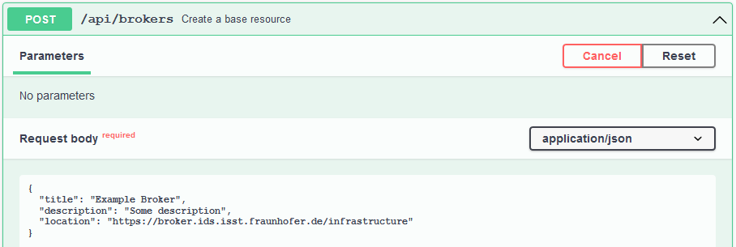
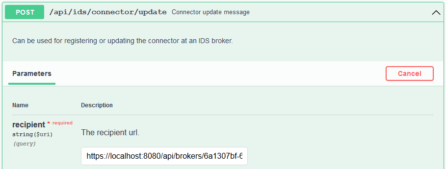
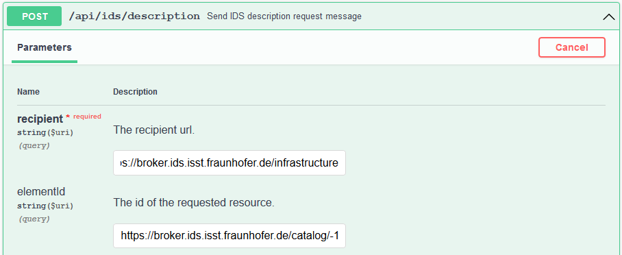

# IDS Metadata Broker
{: .fs-9 }

This section provides a detailed guide on communication with the IDS Metadata Broker.
{: .fs-6 .fw-300 }

---

The IDS Metadata Broker is available at
[https://broker.ids.isst.fraunhofer.de](https://broker.ids.isst.fraunhofer.de). It expects IDS
multipart messages at [https://broker.ids.isst.fraunhofer.de/infrastructure](https://broker.ids.isst.fraunhofer.de/infrastructure).
The GUI can be accessed at [https://broker.ids.isst.fraunhofer.de/browse](https://broker.ids.isst.fraunhofer.de/browse).
To get your IP address unblocked, please contact [us](mailto:info@dataspace-connector.de).

The [repository](https://github.com/International-Data-Spaces-Association/metadata-broker-open-core)
is open source and can be accessed at GitHub. Further documentation about the IDS Metadata Broker
can be seen [here](https://github.com/International-Data-Spaces-Association/IDS-G/blob/main/Components/MetaDataBroker/README.md).

---

**Note**: If you are interested in use cases from mobility data space, have a look at
[this](https://github.com/Mobility-Data-Space/mobility-data-space/wiki) guide.

---

The Dataspace Connector provides some endpoints to send IDS messages that can be processed by the
Broker.

- `POST /api/ids/connector/update`: send a `ConnectorUpdateMessage` with the Connector's
  self-description as `payload` to register at the IDS participant.
- `POST /api/ids/connector/unavailable`: send a `ConnectorUnavailableMessage` to unregister the
  Connector from the IDS participant.
- `POST /api/ids/resource/update`: register or update a previously created resource offer at the IDS
  participant.
- `POST /api/ids/resource/unavailable`: remove a previously registered resource offer from the IDS
  participant.
- `POST /api/ids/query`: send a `QueryMessage` with a SPARQL command (request parameter) as
  `payload`.
- **new** `POST /api/ids/search`: send a  `QueryMessage` with predefined SPARQL commands to perform
  full-text search at the IDS Broker.

---

**Note**: These endpoints are not necessarily limited to broker communication. They can also be
used for other purposes, e.g. see [here](../provider.md#resource-updates).

---

The recipient can be either a URL where the addressed Broker expects IDS messages. Alternatively,
brokers can be managed and persisted in the connector. So the broker can be referenced by its id
when sending messages. Therefore, follow these steps:

## Prerequisites

Please ensure that your connector uses a valid IDS certificate. For this, take a look at
[these](../../../deployment/configuration.md#step-2-ids-certificate) configuration steps and
[this](identityProvider.md#aisec-daps-issuing-an-ids-certificate) guide for issuing a certificate.

## Step 1: Create broker entity (optional)

First, create a broker via `POST /api/brokers`:

```
curl -X 'POST' \
  'https://localhost:8080/api/brokers' \
  -H 'accept: */*' \
  -H 'Content-Type: application/json' \
  -d '{
  "title": "Example Broker",
  "description": "Some description",
  "location": "https://broker.ids.isst.fraunhofer.de/infrastructure"
}'
```



Response:
```json
{
  "creationDate": "2021-07-30T10:53:53.022+0200",
  "modificationDate": "2021-07-30T10:53:53.022+0200",
  "location": "https://broker.ids.isst.fraunhofer.de/infrastructure",
  "title": "Example Broker",
  "description": "Some description",
  "status": "Unregistered",
  "_links": {
    "self": {
      "href": "https://localhost:8080/api/brokers/6a1307bf-6dbd-49b6-ad28-753f29f42502"
    },
    "resources": {
      "href": "https://localhost:8080/api/brokers/6a1307bf-6dbd-49b6-ad28-753f29f42502/offers{?page,size}",
      "templated": true
    }
  }
}
```

Then, when using the messaging endpoints, you can set a broker id (e.g. https://localhost:8080/api/brokers/6a1307bf-6dbd-49b6-ad28-753f29f42502)
as the recipient, instead of a direct URL. The Dataspace Connector will search its database and see
whether it knows a broker with this id. In case of a match, the `location` is selected and used as
recipient address.



## Step 2: Register connector at broker

Use the `POST /api/ids/connector/update` endpoint to register your Connector at the Broker to then
register resources. For the running Broker in the IDS lab, make sure that you provide some
prerequisites:
* Turn on the `PRODUCTIVE_DEPLOYMENT` mode with a valid IDS certificate (as described
  [here](../../../deployment/configuration.md#step-2-ids-certificate)). Otherwise, you will receive a
  `RejectionMessage` indicating that you are not authorized to request anything.
* Make sure that you already created some catalog, as the Broker cannot add resources when the
  previously registered connector does not contain a resource catalog.
* Provide a unique identifier for your Connector as the Broker and other potential consumers need
  this one to manage connectors or get in contact with you for a data exchange.

When you used a broker id to send the message, the Dataspace Connector will automatically handle
information about the registration status of the Connector at a contacted Broker.

```json
{
  "creationDate": "2021-07-30T14:02:23.514+0200",
  "modificationDate": "2021-07-30T14:02:23.514+0200",
  "location": "https://broker.ids.isst.fraunhofer.de/infrastructure",
  "title": "Example Broker",
  "description": "Some description",
  "status": "Registered",
  "_links": {
    "self": {
      "href": "https://localhost:8080/api/brokers/6a1307bf-6dbd-49b6-ad28-753f29f42502"
    },
    "resources": {
      "href": "https://localhost:8080/api/brokers/6a1307bf-6dbd-49b6-ad28-753f29f42502/offers{?page,size}",
      "templated": true
    }
  }
}
```

## Step 3: Register resource at broker

Use the `POST /api/ids/resource/update` endpoint to register resources at the Broker. Make sure you
first followed [Step 2](#step-2-register-connector-at-broker) and correctly provided a complete
resource in your Connector (as described [here](../provider.md#step-1-register-data-resources)).

When you used a broker id to send the message, the Dataspace Connector will automatically handle
information about what resource was registered at what broker.
* To get all offers registered at a broker, use `GET /api/brokers/{id}/offers`.
* To get all brokers an offer has been registered to, use `/api/offers/{id}/brokers`.

## Full-text search

With the endpoint `POST /api/ids/query`, you have the possibility to query the IDS Broker. As you
may not be familiar with the SPARQL query language, the Dataspace Connector provides a full-text
search endpoint at `POST /api/ids/search`. This expects any keyword you would like to search for in
the Broker.

As a response, you retrieve a list of all matches. An example snippet:
```
<https://broker.ids.isst.fraunhofer.de/catalog/-1841216451>	"DB Connector"
<https://broker.ids.isst.fraunhofer.de/catalog/-1841216451>	"IDS Connector der DB"
<https://broker.ids.isst.fraunhofer.de/connectors/-2038069312>	"Dataspace Connector"
```

These links can be used to access more detailed information via IDS-REST calls. As the Dataspace
Connector currently does not support IDS-REST, you are free to use the `POST /api/ids/description`
endpoint to request more details using the provided reference. Please be aware that this endpoint
does not expect an broker id at the moment, so please use the URL directly. Find an example in the
following picture:



The curl statement:
```
curl -X 'POST' \
  'https://localhost:8080/api/ids/description?recipient=https%3A%2F%2Fbroker.ids.isst.fraunhofer.de%2Finfrastructure&elementId=https%3A%2F%2Fbroker.ids.isst.fraunhofer.de%2Fcatalog%2F-1841216451' \
  -H 'accept: */*' \
  -d ''
```

The response:
```json
{
  "@graph" : [ {
    "@id" : "https://broker.ids.isst.fraunhofer.de/catalog/-1841216451",
    "@type" : "ids:BaseConnector",
    "sameAs" : "https://ids.db-connector.test.mobilitydataspace.io",
    "curator" : "https://www.ivi.fraunhofer.de/",
    "description" : "IDS Connector der DB",
    "hasDefaultEndpoint" : "https://broker.ids.isst.fraunhofer.de/catalog/-1841216451/353210985/301497179/1099522629",
    "inboundModelVersion" : "4.0.0",
    "maintainer" : "https://www.isst.fraunhofer.de/",
    "outboundModelVersion" : "4.0.0",
    "publicKey" : "https://w3id.org/idsa/autogen/publicKey/78eb73a3-3a2a-4626-a0ff-631ab50a00f9",
    "resourceCatalog" : "https://broker.ids.isst.fraunhofer.de/catalog/-1841216451/353210985",
    "securityProfile" : "https://w3id.org/idsa/code/BASE_SECURITY_PROFILE",
    "title" : "DB Connector",
    "version" : "4.0.0"
  }, {
    "@id" : "https://broker.ids.isst.fraunhofer.de/catalog/-1841216451/353210985",
    "@type" : "ids:ResourceCatalog",
    "sameAs" : "https://w3id.org/idsa/autogen/resourceCatalog/4b59ad0f-9445-46a0-9742-149ff28cec3e",
    "offeredResource" : "https://broker.ids.isst.fraunhofer.de/catalog/-1841216451/353210985/301497179"
  }, {
    "@id" : "https://broker.ids.isst.fraunhofer.de/catalog/-1841216451/353210985/301497179",
    "@type" : "ids:Resource",
    "sameAs" : "https://w3id.org/idsa/autogen/resource/99795317-0aaa-4fe1-b336-b2e26a00597f",
    "contractOffer" : "https://broker.ids.isst.fraunhofer.de/catalog/-1841216451/353210985/301497179/-1356166576",
    "created" : "2021-04-13T14:10:32.956Z",
    "description" : {
      "@language" : "en",
      "@value" : "Der aktuelle Funktionsstatus der Aufzuege in den Liegenschaften der Deutschen Bahn."
    },
    "language" : "https://w3id.org/idsa/code/EN",
    "modified" : "2021-04-13T14:10:32.956Z",
    "representation" : "https://broker.ids.isst.fraunhofer.de/catalog/-1841216451/353210985/301497179/-1304458746",
    "resourceEndpoint" : "https://broker.ids.isst.fraunhofer.de/catalog/-1841216451/353210985/301497179/1099522629",
    "title" : {
      "@language" : "en",
      "@value" : "DB Infrastruktur - Status Aufzüge"
    }
  }, {
    "@id" : "https://broker.ids.isst.fraunhofer.de/catalog/-1841216451/353210985/301497179/-1304458746",
    "@type" : "ids:Representation",
    "sameAs" : "https://w3id.org/idsa/autogen/representation/a5bb473c-806b-4354-a63e-704ec0f5bddf",
    "instance" : "https://broker.ids.isst.fraunhofer.de/catalog/-1841216451/353210985/301497179/-1304458746/-1830561439",
    "language" : "https://w3id.org/idsa/code/EN",
    "mediaType" : "https://w3id.org/idsa/autogen/iANAMediaType/017d2435-0239-47df-8d6b-3b5721df8ffa"
  }, {
    "@id" : "https://broker.ids.isst.fraunhofer.de/catalog/-1841216451/353210985/301497179/-1304458746/-1830561439",
    "@type" : "ids:Artifact",
    "sameAs" : "https://w3id.org/idsa/autogen/artifact/a5bb473c-806b-4354-a63e-704ec0f5bddf",
    "ids:byteSize" : 101
  }, {
    "@id" : "https://broker.ids.isst.fraunhofer.de/catalog/-1841216451/353210985/301497179/-1356166576",
    "@type" : "ids:ContractOffer",
    "sameAs" : "https://w3id.org/idsa/autogen/contractOffer/1f2b5f1d-73f2-4574-894b-82ea644b73d7",
    "permission" : "https://broker.ids.isst.fraunhofer.de/catalog/-1841216451/353210985/301497179/-1356166576/1164725752",
    "provider" : "https://broker.ids.isst.fraunhofer.de/catalog/-1841216451"
  }, {
    "@id" : "https://broker.ids.isst.fraunhofer.de/catalog/-1841216451/353210985/301497179/-1356166576/1164725752",
    "@type" : "ids:Permission",
    "sameAs" : "https://w3id.org/idsa/autogen/permission/76d75e3d-3b4e-4906-8520-6791a875769a",
    "action" : "https://w3id.org/idsa/code/USE",
    "description" : "provide-access",
    "title" : "Example Usage Policy"
  }, {
    "@id" : "https://broker.ids.isst.fraunhofer.de/catalog/-1841216451/353210985/301497179/1099522629",
    "@type" : "ids:ConnectorEndpoint",
    "sameAs" : "https://w3id.org/idsa/autogen/connectorEndpoint/e5e2ab04-633a-44b9-87d9-a097ae6da3cf",
    "accessURL" : "https://ids.db-connector.test.mobilitydataspace.io/api/ids/data"
  }, {
    "@id" : "https://w3id.org/idsa/autogen/iANAMediaType/017d2435-0239-47df-8d6b-3b5721df8ffa",
    "@type" : "ids:IANAMediaType",
    "filenameExtension" : "XML"
  }, {
    "@id" : "https://w3id.org/idsa/autogen/publicKey/78eb73a3-3a2a-4626-a0ff-631ab50a00f9",
    "@type" : "ids:PublicKey",
    "keyType" : "https://w3id.org/idsa/code/RSA",
    "keyValue" : "VFVsSlFrbHFRVTVDWjJ0eGFHdHBSemwzTUVKQlVVVkdRVUZQUTBGUk9FRk5TVWxDUTJkTFEwRlJSVUYxZHpadFJuSmtabXhZV2xSS1owWlBRVFZ6YlVSWVF6QTVVMjF3U2xkdlIzQjVSVkphVGtWNU16RndTMlJ6VWtkb1ZHbHdVakkzYWpscGNtMXRjV2xvZGpkblNXZDZRMjU0Tm10SlVrNUhTVEoxTUc5R1VUVkdaM1pQTVhoNFozcGphV2hrY0VZd1EyaGxUMlk1U1U1bmFYTlFhM0UxYUdvNFFXVXZSRmxZYTNacWFGRTJZelpoYXk5YVdXWnFNRTV3Y1hsRlVHTktOVTFNVW0xWlIyVjRUV0ZOV20xVVluRkVTblpLYkRWS1J6TXJZa1V6V1dFeU1XaFVXbGxQZUdsVGFXTndaa1puU2pNd2EyNDFZVlZKUVhSa01EVkpXbmszZWpGelJHbFdUSFJVV0d4TVptVXZXbEZETkhCdWFrWjBjeXQwWXpFeWMxZzVhV2hKYlc1RGEyUXdWM1o2TTBOVVdtOTVRbE56WXpGVVpFSnJZamx0TUVNMWRIWm5NR1pSVURSUlowWXZla2d5VVc5YWJtNXlTVFV5ZFVGYU9FMXZiVmQwV1RKc2RETkVNR3RyY0ZJMk9YQm1Wa1JLTjNremRrNHZaWGRKUkVGUlFVST0="
  } ],
  "@context" : {
    "title" : {
      "@id" : "https://w3id.org/idsa/core/title"
    },
    "description" : {
      "@id" : "https://w3id.org/idsa/core/description"
    },
    "action" : {
      "@id" : "https://w3id.org/idsa/core/action",
      "@type" : "@id"
    },
    "sameAs" : {
      "@id" : "http://www.w3.org/2002/07/owl#sameAs",
      "@type" : "@id"
    },
    "language" : {
      "@id" : "https://w3id.org/idsa/core/language",
      "@type" : "@id"
    },
    "mediaType" : {
      "@id" : "https://w3id.org/idsa/core/mediaType",
      "@type" : "@id"
    },
    "instance" : {
      "@id" : "https://w3id.org/idsa/core/instance",
      "@type" : "@id"
    },
    "accessURL" : {
      "@id" : "https://w3id.org/idsa/core/accessURL",
      "@type" : "@id"
    },
    "modified" : {
      "@id" : "https://w3id.org/idsa/core/modified",
      "@type" : "http://www.w3.org/2001/XMLSchema#dateTime"
    },
    "contractOffer" : {
      "@id" : "https://w3id.org/idsa/core/contractOffer",
      "@type" : "@id"
    },
    "created" : {
      "@id" : "https://w3id.org/idsa/core/created",
      "@type" : "http://www.w3.org/2001/XMLSchema#dateTime"
    },
    "resourceEndpoint" : {
      "@id" : "https://w3id.org/idsa/core/resourceEndpoint",
      "@type" : "@id"
    },
    "representation" : {
      "@id" : "https://w3id.org/idsa/core/representation",
      "@type" : "@id"
    },
    "provider" : {
      "@id" : "https://w3id.org/idsa/core/provider",
      "@type" : "@id"
    },
    "permission" : {
      "@id" : "https://w3id.org/idsa/core/permission",
      "@type" : "@id"
    },
    "curator" : {
      "@id" : "https://w3id.org/idsa/core/curator",
      "@type" : "@id"
    },
    "inboundModelVersion" : {
      "@id" : "https://w3id.org/idsa/core/inboundModelVersion"
    },
    "hasDefaultEndpoint" : {
      "@id" : "https://w3id.org/idsa/core/hasDefaultEndpoint",
      "@type" : "@id"
    },
    "version" : {
      "@id" : "https://w3id.org/idsa/core/version"
    },
    "maintainer" : {
      "@id" : "https://w3id.org/idsa/core/maintainer",
      "@type" : "@id"
    },
    "resourceCatalog" : {
      "@id" : "https://w3id.org/idsa/core/resourceCatalog",
      "@type" : "@id"
    },
    "securityProfile" : {
      "@id" : "https://w3id.org/idsa/core/securityProfile",
      "@type" : "@id"
    },
    "publicKey" : {
      "@id" : "https://w3id.org/idsa/core/publicKey",
      "@type" : "@id"
    },
    "outboundModelVersion" : {
      "@id" : "https://w3id.org/idsa/core/outboundModelVersion"
    },
    "byteSize" : {
      "@id" : "https://w3id.org/idsa/core/byteSize",
      "@type" : "http://www.w3.org/2001/XMLSchema#integer"
    },
    "offeredResource" : {
      "@id" : "https://w3id.org/idsa/core/offeredResource",
      "@type" : "@id"
    },
    "filenameExtension" : {
      "@id" : "https://w3id.org/idsa/core/filenameExtension"
    },
    "keyValue" : {
      "@id" : "https://w3id.org/idsa/core/keyValue"
    },
    "keyType" : {
      "@id" : "https://w3id.org/idsa/core/keyType",
      "@type" : "@id"
    },
    "owl" : "http://www.w3.org/2002/07/owl#",
    "ids" : "https://w3id.org/idsa/core/"
  }
}

```
