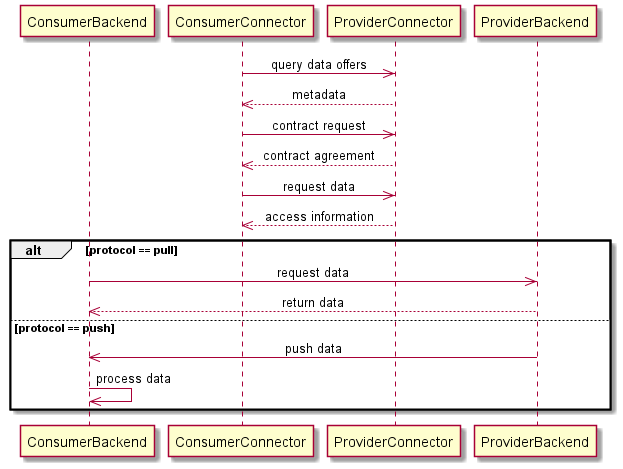

# Streaming
{: .fs-9 }

Find a concept on how to exchange data via different protocols in this section.
{: .fs-6 .fw-300 }

---

As the IDS multipart messages exchanged with other IDS Connectors do not support streaming use
cases, we try to define a concept in the following.

Usually, it is intended to exchange data within an `ArtifactResponseMessage` as the reply to an
`ArtifactRequestMessage`. This way, the IDS identity handshake and IDS-specific message details
ensure that a sovereign data exchange happens between valid IDS participants of a data ecosystem.
To being able to support data streaming but not losing the IDS features, we want to send as many
messages as possible and necessary over an IDS protocol and only switch protocols for the actual
data exchange.

That means that, as visualized in the diagram below, the data offer querying, the negotiation phase,
and some information exchange are still send over IDS. However, instead of the actual data, the
`ArtifactResponseMessage` contains some information about where and how the consumer can retrieve
the data from. That may cover e.g. a location, some authentication information, or protocol details.

This way, a consumer still has to negotiate a contract to get access to the provider's data and also
policies can be enforced for the access data. After that, the consumer can take the provided
information and establish a connection directly between the provider's system acting as a data
source, and a system on the consumer-side acting as the data sink.
This offers the possibility to establish and leave connections open, or to switch from data pulling
to data pushing. Requirements regarding data volume and transfer in real time can thus be ensured by
corresponding systems and are not limited by the Dataspace Connector.

---

**Note**: Policies can only be enforced for data that is exchanged via IDS protocol. Thus, as a
consumer, make sure that your system, that is responsible for the actual data exchange, is aware of
the usage policies and can ensure its compliance.
