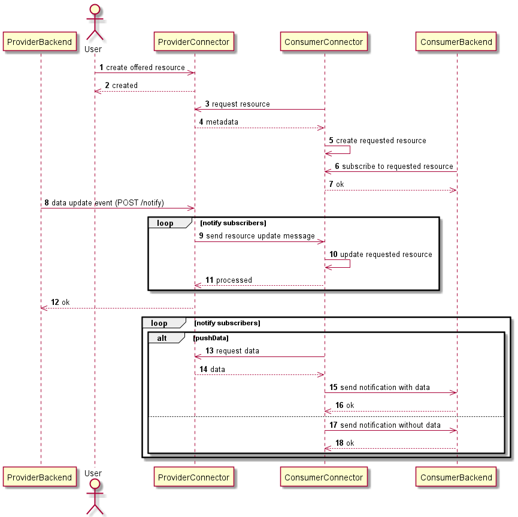
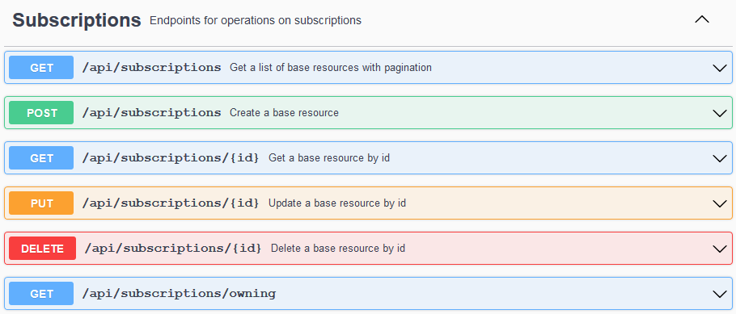
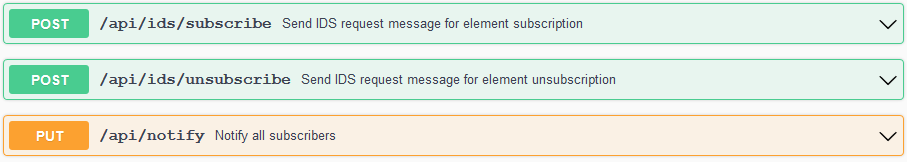

# Subscription
{: .fs-9 }

See how to subscribe to resources as IDS or non-IDS system.
{: .fs-6 .fw-300 }

---

Using the Dataspace Connector, the data exchange between data provider and consumer is always
initiated by the consumer connector asking for metadata and then pulling the data. In some use
cases, the data on the provider side is regularly updated. These updates must be propagated all the
way to the consumer, both connector and data processing service in the background.

The consumer already has the ability to send parameterized queries to potentially filter the
retrieved data, e.g. for a specific time period. Nevertheless, until Dataspace Connector v5, the
consumer has to periodically pull to detect a data update because there was no way for the consumer
connector to notify a connected backend in an event-driven manner. Also, notifying about updates
from provider to consumer connector was quite a complicated task to be done by manually triggering
the sending of IDS `ResourceUpdateMessages`.

The subscription process implemented in v6 actually does the same thing. However, a provider backend
does not need to remember which consumer has subscribed and who needs to be notified at which
address. Instead, the Dataspace Connector persists this information and sends out notifications
automatically.



The subscription mechanism follows webhook patterns: a subscriber creates a request that includes
where a response is expected. The current implementation does not allow defining a protocol. Per
default, http POST requests are made.

---

**Note**: If you would like to keep an open connector for receiving updates via e.g. MQTT, a custom
service could offer this functionality and listen to events from the Dataspace Connector, as this
does not offer such a functionality by now.

---

In the Dataspace Connector, a subscription can be created by using a json object:

```json
{
  "title": "string",
  "description": "string",
  "target": "uri",
  "location": "uri",
  "subscriber": "uri",
  "pushData": true
}
```

A `title` and `description` offer further information and can be added optionally. The `target`
points to the object that should be watched. As an IDS subscriber, this can be an offer, a
representation, or an artifact. As a non-IDS subscriber, subscriptions can be created for requests,
representations, or artifacts.

The `location` represents e.g. a URL that expects the notification. The `subscriber` URI uniquely
identifies the subscribing system. The boolean `pushData` states whether the data should be directly
pushed to the subscriber or not.

## Example

In the following example, it is assumed that the contract negotiation and an initial data exchange
has already been set up. So how to propagate a data update from the provider's backend to the
consumer's backend now?

### Step 1: Create a non-IDS subscription

A custom service on the consumer side should be notified about updates of requested resources. The
connector's administrator does not want the application or service to access all REST endpoints.
Thus, the application uses the application account defined in the `application.properties`.

```properties
spring.security.app.name=...
spring.security.app.password=...
```

Subscriptions can be managed with the provided CRUD endpoints.



Subscriptions will be automatically added to the respective target entity via a POST request. As
described above, subscriptions can point at requests, representations, and artifacts. All
subscriptions for an entity can be accessed via a separate endpoint.

Create subscription:

```
curl -X 'POST' \
  'https://localhost:8080/api/subscriptions' \
  -H 'accept: */*' \
  -H 'Content-Type: application/json' \
  -d '{
  "title": "Example",
  "description": "Notify on update",
  "target": "https://localhost:8080/api/requests/3660e95a-41bf-488b-8bff-3bfe7c19b633",
  "location": "https://backend/event",
  "subscriber": "https://customBackend",
  "pushData": true
}'
```

Response:

```json
{
  "creationDate": "2021-08-02T14:30:31.921+0200",
  "modificationDate": "2021-08-02T14:30:31.921+0200",
  "target": "https://localhost:8080/api/requests/3660e95a-41bf-488b-8bff-3bfe7c19b633",
  "location": "https://backend/event",
  "subscriber": "https://customBackend",
  "pushData": true,
  "idsProtocol": false,
  "additional": {},
  "_links": {
    "self": {
      "href": "https://localhost:8080/api/subscriptions/120665fa-7156-49f5-b0cc-952b1bf64228"
    }
  }
}
```

`GET https://localhost:8080/api/requests/3660e95a-41bf-488b-8bff-3bfe7c19b633/subscriptions`:

```json
{
  "_embedded": {
    "subscriptions": [
      {
        "creationDate": "2021-08-02T14:30:31.921+0200",
        "modificationDate": "2021-08-02T14:30:31.921+0200",
        "target": "https://localhost:8080/api/requests/3660e95a-41bf-488b-8bff-3bfe7c19b633",
        "location": "https://backend/event",
        "subscriber": "https://customBackend",
        "pushData": true,
        "idsProtocol": false,
        "additional": {},
        "_links": {
          "self": {
            "href": "https://localhost:8080/api/subscriptions/120665fa-7156-49f5-b0cc-952b1bf64228"
          }
        }
      }
    ]
  },
  "_links": {
    "self": {
      "href": "https://localhost:8080/api/requests/3660e95a-41bf-488b-8bff-3bfe7c19b633/subscriptions?page=0&size=30"
    }
  },
  "page": {
    "size": 30,
    "totalElements": 1,
    "totalPages": 1,
    "number": 0
  }
}
```

### Step 2: Create an IDS subscription

For subscribing as an IDS consumer connector to an IDS provider connector, other endpoints are
provided:



As a body, the same subscription object is expected. As described above, IDS subscribers can
subscribe to offers, representations, and artifacts.

```
curl -X 'POST' \
  'https://localhost:8080/api/ids/subscribe?recipient=https%3A%2F%2Flocalhost%3A8080%2Fapi%2Fids%2Fdata' \
  -H 'accept: */*' \
  -H 'Content-Type: application/json' \
  -d '{
  "title": "IDS Example",
  "description": "Notify on update",
  "target": "https://localhost:8080/api/offers/3660e95a-41bf-488b-8bff-3bfe7c19b633",
  "location": "https://localhost:8080/api/ids/data",
  "subscriber": "https://localhost:8080",
  "pushData": false
}'
```

Response: `200 Successfully subscribed to ...`

For IDS communication, custom IDS `RequestMessages` are used. An example is shown below:

Header:
```json
{
  "@context" : {
    "ids" : "https://w3id.org/idsa/core/",
    "idsc" : "https://w3id.org/idsa/code/"
  },
  "@type" : "ids:RequestMessage",
  "@id" : "https://w3id.org/idsa/autogen/requestMessage/38b56ba4-1fc1-4dae-9775-7c7d76941dc6",
  "ids:recipientConnector" : [ {
    "@id" : "https://localhost:8080/api/ids/data"
  } ],
  "ids:issuerConnector" : {
    "@id" : "https://localhost:8081"
  },
  "ids:senderAgent" : {
    "@id" : "https://localhost:8081"
  },
  "ids:modelVersion" : "4.1.0",
  "ids:issued" : {
    "@value" : "2021-08-02T14:47:51.467+02:00",
    "@type" : "http://www.w3.org/2001/XMLSchema#dateTimeStamp"
  },
  "ids:securityToken" : {
    "@type" : "ids:DynamicAttributeToken",
    "@id" : "https://w3id.org/idsa/autogen/dynamicAttributeToken/1bf4a886-2658-448a-bfe9-cbc3fafd7a18",
    "ids:tokenFormat" : {
      "@id" : "https://w3id.org/idsa/code/JWT"
    },
    "ids:tokenValue" : "..."
  },
  "ids:target" : {
    "@id" : "https://localhost:8080/api/offers/3660e95a-41bf-488b-8bff-3bfe7c19b633"
  }
}
```

Payload:

```json
{
  "title":"IDS Example",
  "description":"Notify on update",
  "target":"https://localhost:8080/api/offers/3660e95a-41bf-488b-8bff-3bfe7c19b633",
  "location":"https://localhost:8081/api/ids/data",
  "subscriber":"https://localhost:8081",
  "pushData":false
}
```

On the provider side, the `subscriber` is set to the message's `issuerConnector` and the boolean
`idsProtocol` is set to true. Then, the subscription is persisted and linked to the target object.
If something went wrong, e.g. the target does not exist, a matching subscription message is
returned.

---

**Hint**: For managing own subscriptions, as a consumer connector, the REST endpoint
`/api/subscriptions/owning` is provided. It returns a list of subscriptions at other IDS connectors.

---

For unsubscribing from an object, the endpoint `/api/ids/unsubscribe` can be used. It only expects
a target URI and automatically send respective IDS messages, as shown below:

```json
{
  "@context" : {
    "ids" : "https://w3id.org/idsa/core/",
    "idsc" : "https://w3id.org/idsa/code/"
  },
  "@type" : "ids:RequestMessage",
  "@id" : "https://w3id.org/idsa/autogen/requestMessage/589324d0-6e1e-4948-9910-6922319ddb9a",
  "ids:recipientConnector" : [ {
    "@id" : "https://localhost:8080/api/ids/data"
  } ],
  "ids:issuerConnector" : {
    "@id" : "https://localhost:8081"
  },
  "ids:senderAgent" : {
    "@id" : "https://localhost:8081"
  },
  "ids:modelVersion" : "4.1.0",
  "ids:issued" : {
    "@value" : "2021-08-02T14:51:08.853+02:00",
    "@type" : "http://www.w3.org/2001/XMLSchema#dateTimeStamp"
  },
  "ids:securityToken" : {
    "@type" : "ids:DynamicAttributeToken",
    "@id" : "https://w3id.org/idsa/autogen/dynamicAttributeToken/3af55841-fb7b-493e-8570-9533ba0a7c8c",
    "ids:tokenFormat" : {
      "@id" : "https://w3id.org/idsa/code/JWT"
    },
    "ids:tokenValue" : "..."
  },
  "ids:target" : {
    "@id" : "https://localhost:8080/api/offers/3660e95a-41bf-488b-8bff-3bfe7c19b633"
  }
}
```

Response: `200 Successfully unsubscribed from ...`

### Step 3: Notify subscribers

As a last step, the subscribers need to be notified on data update events. The Dataspace Connector
offers two possibilities for that:
1. It automatically notifies the subscribers on an update via the REST API. That means, as soon as
   some user or system sends a PUT request to a request, offer, representation, or artifact
   endpoint, the Connector retrieves the list of subscriptions from its database, checks if the
   subscriber wants to be updated via IDS message or not, and sends the respective message.
2. If no metadata update occurs, but maybe the remote data of a connected system has changed anyway,
   the Connector provides an endpoint `/api/notify` to notify all subscribers. Unlike manually
   triggering the ResourceUpdateMessages as described [here](provider.md#resource-updates), the
   Connector does not need any input about who exactly wants to be notified. It gets all information
   from its database as in option 1.

---

**Note**: Automated or manually triggered update events will notify all subscribers to the matching
object, as well as all subscribers of its children.

---

Depending on how the subscription has reached the Dataspace Connector, the object is marked by the
flag `idsProtocol`.

#### IDS Notification

The IDS subscribers will be notified via `ResourceUpdateMessage`. It contains the updated metadata
of a resource so the consumer updates its stored information. The data is not pushed to the
consuming connector as the newest data can automatically being retrieved via API call on
`artifacts/{id}/data/**`.

#### Non-IDS Notification

Non-IDS subscribers will receive an http POST request with the following properties. If the
`pushData` boolean is set to `true`, the notification request will contain the data. If not, this
will remain empty. Header arguments help to process which event happened to which target.
* method = POST
* headers = {`ids-event=UPDATED`, `ids-target=https://...`}
* body = `data` (mediaType = "application/octet-stream")
