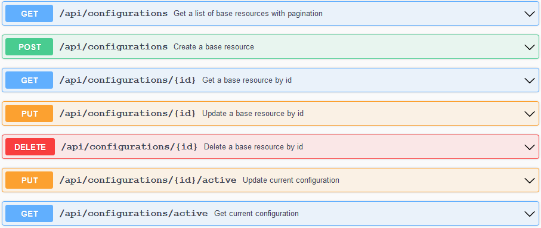
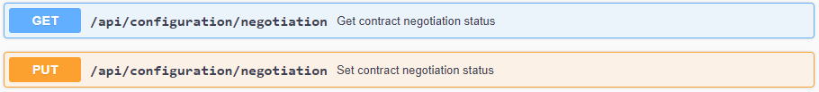
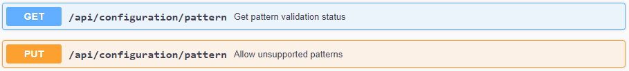

# Configuration
{: .fs-9 }

Customize the Dataspace Connector to fit your use case.
{: .fs-6 .fw-300 }

---

If you want to set up the Dataspace Connector yourself, follow the instructions below. If you
encounter any problems, please have a look at the [FAQ](../faq.md).

At first, clone the repository:
```commandline
git clone https://github.com/International-Data-Spaces-Association/DataspaceConnector.git
```

The resource folder `resources/conf` provides three important files that are loaded at application start:

* `keystore-localhost.p12`: The provided keystore, on the one hand, is used as IDS certificate that
  is loaded by the IDS Messaging Services for requesting a valid [Dynamic Attribute Token](https://github.com/International-Data-Spaces-Association/IDS-G/blob/master/core/DAPS/README.md#dynamic-attribute-token-content) (DAT) from
  the [Dynamic Attribute Provisioning Service](https://github.com/International-Data-Spaces-Association/IDS-G/blob/master/core/DAPS/README.md) (DAPS). Each message to an IDS participant needs to be
  signed with a valid [DAT](https://github.com/International-Data-Spaces-Association/IDS-G/blob/master/core/DAPS/README.md#dynamic-attribute-token-content). On the other hand, it can be used as SSL certificate for TLS encryption.
* `truststore.p12`: The truststore is used by the IDS Messaging Services for any HTTP/S
  communication. It ensures the connection to trusted addresses.
* `config.json`: The configuration is used to set important properties for IDS message handling.

In a Docker or Kubernetes deployment, for a custom setup at least these files have to be set via
environment variables. Find more details [here](build.md#docker) and in the docs for
[Docker](https://docs.docker.com/compose/environment-variables/) and
[Kubernetes](https://kubernetes.io/docs/tasks/inject-data-application/define-environment-variable-container/).

## Step 1: Connector Properties

When starting the application, the `config.json` will be scanned for important connector
information, e.g. its ID, address, contact information, or proxy settings. Please keep this
file up to date to your custom settings. In case you want to use the demo cert, you don't need
to change anything except the proxy settings.

For outgoing requests, the connector needs information about an existing system proxy that needs to
be set in the `resources/conf/config.json`.

```json
"ids:connectorProxy" : [ {
    "@type" : "ids:Proxy",
    "@id" : "https://w3id.org/idsa/autogen/proxy/548dc73a-ccfb-4039-9569-4b8e219b90bc",
    "ids:proxyAuthentication" : {
      "@type" : "ids:BasicAuthentication",
      "@id" : "https://w3id.org/idsa/autogen/basicAuthentication/47e3cd59-d351-4f5b-99fc-561c94bad5e1"
    },
    "ids:proxyURI" : {
      "@id" : "http://host:port"
    },
    "ids:noProxy" : [ {
      "@id" : "https://localhost:8080/"
    }, {
      "@id" : "http://localhost:8080/"
    } ]
  } ]
```

Check if your system is running behind a proxy. If this is the case, specify the `ids:proxyURI` and
change `ids:noProxy` if necessary. Otherwise, delete the key `ids:connectorProxy` and its values.

---

**Note**: If you want to connect to a running connector or any other system running at `https://`,
keep in mind that you need to add the keystore to your truststore. Otherwise, the communication
will fail. With the provided truststore, the Dataspace Connector accepts its own localhost
certificate, public certificates, and any IDS keystore that was provided by the Fraunhofer AISEC.

---

A full configuration example may look like this:
```json
{
  "@context" : {
    "ids" : "https://w3id.org/idsa/core/",
    "idsc" : "https://w3id.org/idsa/code/"
  },
  "@type" : "ids:ConfigurationModel",
  "@id" : "https://w3id.org/idsa/autogen/configurationModel/7672b568-7878-4f62-8032-5c73de969414",
  "ids:configurationModelLogLevel" : {
    "@id" : "idsc:MINIMAL_LOGGING"
  },
  "ids:connectorDeployMode" : {
    "@id" : "idsc:TEST_DEPLOYMENT"
  },
  "ids:connectorDescription" : {
    "@type" : "ids:BaseConnector",
    "@id" : "https://my.ids.connector.com",
    "ids:publicKey" : {
      "@type" : "ids:PublicKey",
      "@id" : "https://w3id.org/idsa/autogen/publicKey/78eb73a3-3a2a-4626-a0ff-631ab50a00f9",
      "ids:keyType" : {
        "@id" : "idsc:RSA"
      },
      "ids:keyValue" : "[...]"
    },
    "ids:description" : [ {
      "@value" : "IDS Connector with static example resources hosted by the Fraunhofer ISST",
      "@type" : "http://www.w3.org/2001/XMLSchema#string"
    } ],
    "ids:version" : "6.0.0",
    "ids:hasDefaultEndpoint" : {
      "@type" : "ids:ConnectorEndpoint",
      "@id" : "https://w3id.org/idsa/autogen/connectorEndpoint/e5e2ab04-633a-44b9-87d9-a097ae6da3cf",
      "ids:accessURL" : {
        "@id" : "https://my.ids.connector.com/api/ids/data"
      }
    },
    "ids:outboundModelVersion" : "4.0.4",
    "ids:inboundModelVersion" : [ "4.0.0", "4.0.4" ],
    "ids:title" : [ {
      "@value" : "Dataspace Connector",
      "@type" : "http://www.w3.org/2001/XMLSchema#string"
    } ],
    "ids:securityProfile" : {
      "@id" : "idsc:BASE_SECURITY_PROFILE"
    },
    "ids:curator" : {
      "@id" : "https://www.isst.fraunhofer.de/"
    },
    "ids:maintainer" : {
      "@id" : "https://www.isst.fraunhofer.de/"
    }
  },
  "ids:trustStore" : {
    "@id" : "file:///conf/truststore.p12"
  },
  "ids:connectorStatus" : {
    "@id" : "idsc:CONNECTOR_ONLINE"
  },
  "ids:keyStore" : {
    "@id" : "file:///conf/keystore.p12"
  },
  "ids:connectorProxy" : [ {
    "@type" : "ids:Proxy",
    "@id" : "https://w3id.org/idsa/autogen/proxy/548dc73a-ccfb-4039-9569-4b8e219b90bc",
    "ids:proxyAuthentication" : {
      "@type" : "ids:BasicAuthentication",
      "@id" : "https://w3id.org/idsa/autogen/basicAuthentication/47e3cd59-d351-4f5b-99fc-561c94bad5e1"
    },
    "ids:proxyURI" : {
      "@id" : "http://proxy.dortmund.isst.fraunhofer.de:3128"
    },
    "ids:noProxy" : [ {
      "@id" : "https://localhost:8080/"
    }, {
      "@id" : "http://localhost:8080/"
    }, {
      "@id" : "https://localhost:8081/"
    }, {
      "@id" : "http://localhost:8081/"
    } ]
  } ]
}
```

### Configuration Persistence

**New**: Since v6.0.0, the Dataspace Connector offers CRUD endpoints for managing multiple
configurations. For a first start, the `config.json` will be loaded. All settings will then be
persisted in the database, so the application does not "forget" them on a restart.
On top of that, you can switch between multiple configurations. Just use the corresponding endpoints
to see what configuration is active and change it, if wanted.



With this, e.g. the deploy mode can be changed at runtime. On top of that, with v6.1.0, the
connector offers the possibility to be set to `offline`. Only if the connector status is set to
`online`, incoming requests at `/api/ids/data` will be processed. Otherwise, the requesting
connector receives a rejection message:

````json
{
  "reason": {
    "@id": "https://w3id.org/idsa/code/TEMPORARILY_NOT_AVAILABLE",
    "properties": None
  },
  "payload": "This connector is offline. Your messages will not be processed or persisted.",
  "type": "de.fraunhofer.iais.eis.RejectionMessageImpl"
}
````

Per default, the connector status is set to `online`.

---

**Note**: Since the application has a few technical prerequisites, some of the configuration
properties are read-only: the version, the inbound and outbound infomodel versions, the security
profile, and the default endpoint. The latter results from the set connector id.

---

An example configuration could look like this:

```json
{
  "connectorId": "https://localhost:8080",
  "title": "Dataspace Connector",
  "description": "IDS Connector with static example resources hosted by the Fraunhofer ISST",
  "defaultEndpoint": "https://localhost:8080/api/ids/data",
  "version": "6.1.0",
  "curator": "https://www.isst.fraunhofer.de/",
  "maintainer": "https://www.isst.fraunhofer.de/",
  "inboundModelVersion": [
    "4.0.0",
    "4.1.0"
  ],
  "outboundModelVersion": "4.1.0",
  "securityProfile": "Base Security",
  "status": "Online",
  "logLevel": "Warn",
  "deployMode": "Test",
  "proxy": null,
  "trustStore": {
    "location": "file:///conf/truststore.p12",
    "alias": "1"
  },
  "keyStore": {
    "location": "file:///conf/keystore-localhost.p12",
    "alias": "1"
  }
}
```

### Force-load from file

It is now possible to force the reloading of the configuration from the `config.json` when
restarting the Connector. Thus, the configuration marked as active in the database is ignored on
start-up. The data from the `config.json` and the `application.properties` (truststore/keystore
password and alias) are then stored to the connector's database as new active config and can be
changed via the REST API. Every new start of the connector with force reload will trigger the
reloading of the config from the `config.json`. The force reload can be set in the
`application.properties` and is thus needed as an environment variables depending on the setup:

```properties
configuration.force.reload=true/false
```

True will force reloading the config from `config.json` and `application.properties`. The default
value is set to `false`.

---

**Note**: If a configuration is activated at runtime via the REST API that cannot be processed by
the Messaging Services (which then throws a `ConfigUpdateException`), e.g. because values of the
`KeyStore` or `TrustStore` settings are null, the system rolls back to the old working configuration
and sets this as the active configuration.

---


## Step 2: IDS Certificate

In the provided `config.json`, the `ids:connectorDeployMode` is set to `idsc:TEST_DEPLOYMENT`. This
allows to use the `keystore-localhost.p12` as an IDS certificate. For testing purpose, the existing
cert can be used, as on application start, the IDS Messaging Services will not request a valid
[DAT](https://github.com/International-Data-Spaces-Association/IDS-G/blob/master/core/DAPS/README.md#dynamic-attribute-token-content)
from the [DAPS](https://github.com/International-Data-Spaces-Association/IDS-G/blob/master/core/DAPS/README.md)
and for received messages, the sent [DAT](https://github.com/International-Data-Spaces-Association/IDS-G/blob/master/core/DAPS/README.md#dynamic-attribute-token-content)
will not be checked.

To turn on the [DAT](https://github.com/International-Data-Spaces-Association/IDS-G/blob/master/core/DAPS/README.md#dynamic-attribute-token-content)
checking, you need to set the `ids:connectorDeployMode` to`idsc:PRODUCTIVE_DEPLOYMENT`. **For issuing
a trusted IDS certificate, see [here](../communication/v6/ecosystem/identityProvider.md#aisec-daps-issuing-an-ids-certificate)**.
Add the keystore with the IDS certificate inside to the `resources/conf` and change the filename at
`ids:keyStore` accordingly. **In addition, set the connector id to the connector's URL (domain name),
that uniquely identifies the connector towards e.g. the IDS Metadata Broker**:

```json
"ids:connectorDescription" : {
    "@type" : "ids:BaseConnector",
    "@id" : "https://my.ids.connector.com",
```

---

**Note**: The `TEST_DEPLOYMENT` mode and accepting a demo cert is for testing purposes only!
This mode is a **security risk** and cannot ensure that the connector is talking to a verified IDS
participant. Furthermore, messages from the Dataspace Connector without a valid IDS certificate
may not be accepted by other Connector implementations and will not be accepted by the IDS Metadata
Broker running in the IDS lab and the public available IDS AppStore.

---

## Step 3: General Settings (optional)

The `application.properties` specifies several Spring Boot and IDS configurations.

### Tomcat

To define on which port the connector should be running, change `server.port={PORT}`.

### OpenApi

You can change Swagger properties by changing the following settings:

```properties
springdoc.swagger-ui.path=/api/docs
springdoc.swagger-ui.operationsSorter=alpha
springdoc.swagger-ui.tagsSorter=alpha
springdoc.swagger-ui.disable-swagger-default-url=true
springdoc.swagger-ui.doc-expansion= none
springdoc.writer-with-default-pretty-printer=true
```

### SSL

If you want to add your own SSL certificate, check the corresponding path. As the provided
certificate only supports the application running at `localhost`, you may replace this with your
IDS keystore, if you want to host the connector in a productive environment.

```properties
server.ssl.enabled
server.ssl.key-store-type
server.ssl.key-store
server.ssl.key-store-password
server.ssl.key-alias
```

```properties
configuration.path
configuration.keyStorePassword
configuration.keyAlias
configuration.trustStorePassword
```

### Http Connections

For customizing timeout settings for incoming and outgoing requests, you may customize the
following lines:

```properties
http.timeout.connect=10000
http.timeout.read=10000
http.timeout.write=10000
http.timeout.call=10000
```

Not that either the call timeout is used, or the other three values.

### Authentication

The application uses Spring Security. Each endpoint behind `/**`, needs a user
authentication, except the open IDS endpoint at `/api/ids/data`.

Have a look at the blocked endpoints in the `ConfigurationAdapter` class to add or change endpoints
yourself. In case you don't want to provide authentication for your backend maintenance, feel free
to remove the corresponding lines.

For changing the default credentials, the properties are located at
```properties
spring.security.user.name
spring.security.user.password
```
and
```properties
spring.security.app.name
spring.security.app.password
```

### Database

The Dataspace Connector uses Spring Data JPA to set up the database and manage interactions with it.
Spring Data JPA supports many well-known relational databases out of the box. Thus, the internal H2
can be replaced by e.g. MySQL, PostgreSQL, or Oracle databases with minimal effort.

To use another database for the Dataspace Connector, follow [these](database.md) steps.

Settings are provided within the `application.properties` at:

```properties
spring.datasource.url
spring.datasource.driverClassName
spring.datasource.username
spring.datasource.password

spring.h2.console.enabled=false
spring.h2.console.path=/database
spring.h2.console.settings.web-allow-others=true
```

By default, the Dataspace Connector is running with an H2 database that is non persistent. On every
start-up, it thus will be empty again. To change this behaviour, define a file location in the
`application.properties`.

```properties
spring.datasource.url=jdbc:h2:file:./target/db/resources
```

### Logging

The Dataspace Connector provides multiple ways for logging and accessing information. Please find a
detailed description on how to set up static and runtime configurations [here](logging.md).

Settings are provided within the `application.properties` at:

```properties
management.endpoints.enabled-by-default=false
management.endpoints.web.exposure.include=logfile, loggers
management.endpoint.loggers.enabled=true
management.endpoint.logfile.enabled=true
management.endpoint.logfile.external-file=./log/dataspaceconnector.log
```

Http tracing is disabled by default: `httptrace.enabled=false`.

### Jaeger

If your want to access open telemetry, have a look at [this guide](telemetry.md). You can
customize the deployment with these lines:

```properties
opentracing.jaeger.udp-sender.host=localhost
opentracing.jaeger.udp-sender.port=6831
opentracing.jaeger.log-spans=true
```

Open tracing is disabled by default: `opentracing.jaeger.enabled=false`.

### Bootstrapping

If you want to change the base path, which will be used to find properties and catalogs for
bootstrapping, you can customize the following line:

```properties
bootstrap.path=./src/resources
bootstrap.enabled=false
```

Bootstrapping is disabled by default: `bootstrap.enabled=false`.

### IDS Settings

URLs of the [DAPS](https://github.com/International-Data-Spaces-Association/IDS-G/blob/master/core/DAPS/README.md)
for IDS identity management and the Clearing House for contract agreement and data
usage logging can be changed within the following lines:

```properties
daps.url=https://daps.aisec.fraunhofer.de
daps.token.url=https://daps.aisec.fraunhofer.de/v2/token
daps.key.url=https://daps.aisec.fraunhofer.de/v2/.well-known/jwks.json
daps.key.url.kid={'https://daps.aisec.fraunhofer.de/v2/.well-known/jwks.json':'default'}
clearing.house.url=https://ch-ids.aisec.fraunhofer.de/logs/messages/
```

If you leave the Clearing House address blank, the connector will ignore sending IDS messages to it.

Also, for usage control, some settings are provided:

```properties
policy.negotiation=true
policy.allow-unsupported-patterns=false
policy.framework=INTERNAL
```

Contract negotiation is enabled by default. This forces other Connectors to refer to a valid
contract agreement when requesting data access via an `ArtifactRequestMessage`. If you want to
deactivate the policy negotiation, as data provider or data consumer, use the following endpoints
or the corresponding line within the `application.properties`.



---

**Note**: The Dataspace Connector is able to received resources with usage policies that follow
the IDS policy language but not one of the supported patterns. As, by default, the policy check on
the data consumer side would not allow accessing data whose policies cannot be enforced, you are
able to ignore unsupported patterns with setting the boolean at the endpoint
`/api/configuration/pattern` or the property `policy.allow-unsupported-patterns` in the
`application.properties` to `true`. As a data consumer, you are bound to concluded contract
agreements that are technically mapped to IDS usage policies. Therefore, you have to ensure, that
your backend applications technically enforce the usage policies instead.



---

The **IDS Messaging Services** dependency comes with some further settings. For example, you can
specify what DAPS you want to connect to and whether incoming messages should be, in addition,
processed by a SHACL validator.

```properties
daps.mode=aisec
shacl.validation=true
```

---

**Note**: For more configurations, see [here](https://github.com/International-Data-Spaces-Association/IDS-Messaging-Services/wiki/09.-Settings:-Connector-Configuration).

---

As the IDS Messaging Services provide the connector with the ability to communicate via IDS multipart
messages, the IDSCPv2 dependency allows to send and receive the same messages via the IDSCP
protocol. For this and the underlying Camel, some more settings need to be set and can be modified
accordingly:

```properties
## Camel
camel.springboot.main-run-controller=true
camel.truststore.path=classpath:conf/truststore.p12

## IDSCP
application.http.base-url=https://localhost:8080
idscp2.enabled=false
idscp2.keystore=./src/main/resources/conf/keystore-localhost.p12
idscp2.truststore=./src/main/resources/conf/truststore.p12
```
