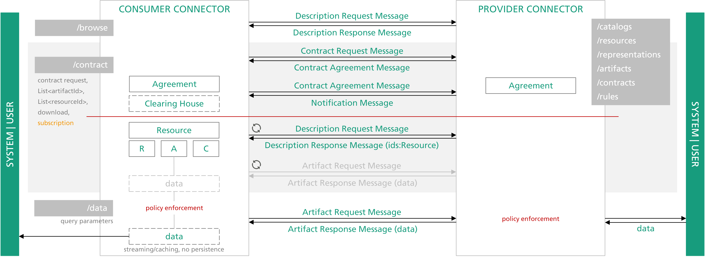
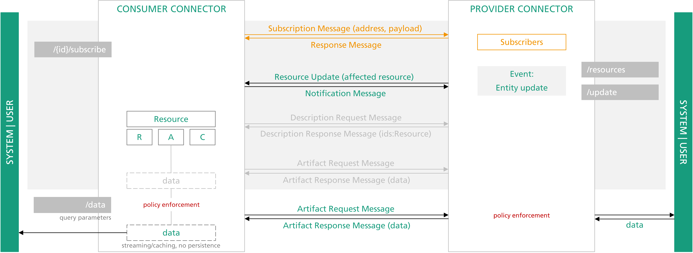

# IDS Messages
{: .fs-9 }

See what IDS message types can be sent and received.
{: .fs-6 .fw-300 }

---

## Message Types

IDS messages and their content are defined
[here](http://htmlpreview.github.io/?https://github.com/IndustrialDataSpace/InformationModel/blob/feature/message_taxonomy_description/model/communication/Message_Description.htm).
The table below lists the supported message types. Thereby, it is to be distinguished whether the
Dataspace Connector provides functionality for sending messages as request or response, or for
processing incoming messages.

| IDS Message Type                    | Outgoing           | Incoming | Description              |
|:------------------------------------|:------------------:|:--------:|:-------------------------|
| ArtifactRequestMessage              | request            | x        | message asking for retrieving a specified artifact  |
| DescriptionRequestMessage           | request            | x        | message requesting metadata (If no URI is supplied via the ids:requestedElement field, this messages is treated like a self-description request.) |
| ContractRequestMessage              | request            | x        | message containing a contract offer |
| ArtifactResponseMessage             | response           |          | message that contains the artifact's data in the payload |
| DescriptionResponseMessage          | response           |          | message containing the metadata of a requested object |
| ContractAgreementMessage            | request + response |          | message containing a contract agreement |
| ContractRejectionMessage            | response           |          | message indicating rejection of a contract |
| RejectionMessage                    | response           |          | message that notifies the issuer that processing the request message has failed |
| NotificationMessage                 | request            | x        | message is informative and no response is expected |
| LogMessage                          | request            |          | message that is used to transfer logs e.g. to the clearing house |
| MessageProcessedNotificationMessage | response           |          | message that notifies whether a message has been received and successfully processed |
| ConnectorUpdateMessage              | request            |          | message notifying the recipient(s) about the availability and current configuration of a connector |
| ConnectorUnavailableMessage         | request            |          | message indicating that a specific connector is unavailable |
| ResourceUpdateMessage               | request            | x        | message indicating the availability and current description of a specific resource |
| ResourceUnavailableMessage          | request            |          | message indicating that a specific resource is unavailable |
| QueryMessage                        | request            |          | message intended to be consumed by specific components |

`request` = initially send this kind of IDS message, `response` = response with this IDS message

## Sequences





## Examples

### Description Request: Self-description

Request Message:
```
{
  "@context" : {
    "ids" : "https://w3id.org/idsa/core/",
    "idsc" : "https://w3id.org/idsa/code/"
  },
  "@type" : "ids:DescriptionRequestMessage",
  "@id" : "https://w3id.org/idsa/autogen/descriptionRequestMessage/cc5afba5-db62-4c68-9858-6fd27c9f521b",
  "ids:senderAgent" : {
    "@id" : "https://w3id.org/idsa/autogen/baseConnector/7b934432-a85e-41c5-9f65-669219dde4ea"
  },
  "ids:issuerConnector" : {
    "@id" : "https://w3id.org/idsa/autogen/baseConnector/7b934432-a85e-41c5-9f65-669219dde4ea"
  },
  "ids:issued" : {
    "@value" : "2020-10-13T13:55:54.345+02:00",
    "@type" : "http://www.w3.org/2001/XMLSchema#dateTimeStamp"
  },
  "ids:modelVersion" : "4.0.0",
  "ids:securityToken" : {
    "@type" : "ids:DynamicAttributeToken",
    "@id" : "https://w3id.org/idsa/autogen/dynamicAttributeToken/21b0ba17-dfb3-42f2-b7d0-ece4debfa4af",
    "ids:tokenValue" : "...",
    "ids:tokenFormat" : {
      "@id" : "idsc:JWT"
    }
  },
  "ids:recipientConnector" : [ {
    "@id" : "https://localhost:8080/api/ids/data"
  } ]
}
```

Response Message:
```json
--
Content-Disposition: form-data; name="header"
Content-Type: text/plain;charset=UTF-8
Content-Length: 1267

{
  "@context" : {
    "ids" : "https://w3id.org/idsa/core/",
    "idsc" : "https://w3id.org/idsa/code/"
  },
  "@type" : "ids:DescriptionResponseMessage",
  "@id" : "https://w3id.org/idsa/autogen/descriptionResponseMessage/d4d67aaa-5e3f-479c-a144-6ada7ced91ad",
  "ids:modelVersion" : "4.0.0",
  "ids:issued" : {
    "@value" : "2021-01-24T17:47:55.143+01:00",
    "@type" : "http://www.w3.org/2001/XMLSchema#dateTimeStamp"
  },
  "ids:issuerConnector" : {
    "@id" : "https://w3id.org/idsa/autogen/baseConnector/7b934432-a85e-41c5-9f65-669219dde4ea"
  },
  "ids:senderAgent" : {
    "@id" : "https://w3id.org/idsa/autogen/baseConnector/7b934432-a85e-41c5-9f65-669219dde4ea"
  },
  "ids:securityToken" : {
    "@type" : "ids:DynamicAttributeToken",
    "@id" : "https://w3id.org/idsa/autogen/dynamicAttributeToken/3fa5130c-6983-4f88-b496-c54f686764c1",
    "ids:tokenValue" : "...",
    "ids:tokenFormat" : {
      "@id" : "idsc:JWT"
    }
  },
  "ids:recipientConnector" : [ {
    "@id" : "https://w3id.org/idsa/autogen/baseConnector/7b934432-a85e-41c5-9f65-669219dde4ea"
  } ],
  "ids:correlationMessage" : {
    "@id" : "https://w3id.org/idsa/autogen/descriptionRequestMessage/d5f9dc10-94a3-4d92-a6ba-e4eea14fd463"
  }
}
--
Content-Disposition: form-data; name="payload"
Content-Type: text/plain;charset=UTF-8
Content-Length: 4051

{
  "@context" : {
    "ids" : "https://w3id.org/idsa/core/",
    "idsc" : "https://w3id.org/idsa/code/"
  },
  "@type" : "ids:BaseConnector",
  ...
}
--
```

### Description Request: Metadata

Request Message:
```json
{
  "@context" : {
    "ids" : "https://w3id.org/idsa/core/",
    "idsc" : "https://w3id.org/idsa/code/"
  },
  "@type" : "ids:DescriptionRequestMessage",
  "@id" : "https://w3id.org/idsa/autogen/descriptionRequestMessage/bb1384e2-bd4b-4c28-b18a-3c95d476ef5a",
  "ids:senderAgent" : {
    "@id" : "https://w3id.org/idsa/autogen/baseConnector/7b934432-a85e-41c5-9f65-669219dde4ea"
  },
  "ids:issuerConnector" : {
    "@id" : "https://w3id.org/idsa/autogen/baseConnector/7b934432-a85e-41c5-9f65-669219dde4ea"
  },
  "ids:issued" : {
    "@value" : "2020-10-13T13:54:29.041+02:00",
    "@type" : "http://www.w3.org/2001/XMLSchema#dateTimeStamp"
  },
  "ids:modelVersion" : "4.0.0",
  "ids:securityToken" : {
    "@type" : "ids:DynamicAttributeToken",
    "@id" : "https://w3id.org/idsa/autogen/dynamicAttributeToken/12977a5e-8014-4457-b2a1-ded777e9730e",
    "ids:tokenValue" : "...",
    "ids:tokenFormat" : {
      "@id" : "idsc:JWT"
    }
  },
  "ids:recipientConnector" : [ {
    "@id" : "https://localhost:8080/api/ids/data"
  } ],
  "ids:requestedElement" : {
    "@id" : "https://w3id.org/idsa/autogen/resource/a4212311-86e4-40b3-ace3-ef29cd687cf9"
  }
}
```

Response Message:

```json
--
Content-Disposition: form-data; name="header"
Content-Type: text/plain;charset=UTF-8
Content-Length: 1267

{
  "@context" : {
    "ids" : "https://w3id.org/idsa/core/",
    "idsc" : "https://w3id.org/idsa/code/"
  },
  "@type" : "ids:DescriptionResponseMessage",
  "@id" : "https://w3id.org/idsa/autogen/descriptionResponseMessage/325d6118-b5aa-4364-a8c0-4b660715aeb9",
  "ids:modelVersion" : "4.0.0",
  "ids:issued" : {
    "@value" : "2021-01-24T17:52:22.760+01:00",
    "@type" : "http://www.w3.org/2001/XMLSchema#dateTimeStamp"
  },
  "ids:issuerConnector" : {
    "@id" : "https://w3id.org/idsa/autogen/baseConnector/7b934432-a85e-41c5-9f65-669219dde4ea"
  },
  "ids:senderAgent" : {
    "@id" : "https://w3id.org/idsa/autogen/baseConnector/7b934432-a85e-41c5-9f65-669219dde4ea"
  },
  "ids:securityToken" : {
    "@type" : "ids:DynamicAttributeToken",
    "@id" : "https://w3id.org/idsa/autogen/dynamicAttributeToken/8ff9b176-22fd-4fc3-a2ff-0d324bb6c515",
    "ids:tokenValue" : "...",
    "ids:tokenFormat" : {
      "@id" : "idsc:JWT"
    }
  },
  "ids:recipientConnector" : [ {
    "@id" : "https://w3id.org/idsa/autogen/baseConnector/7b934432-a85e-41c5-9f65-669219dde4ea"
  } ],
  "ids:correlationMessage" : {
    "@id" : "https://w3id.org/idsa/autogen/descriptionRequestMessage/0c57495a-c31a-461c-a372-6f5d1412f0bd"
  }
}
--
Content-Disposition: form-data; name="payload"
Content-Type: text/plain;charset=UTF-8
Content-Length: 2527

{
  "@context" : {
    "ids" : "https://w3id.org/idsa/core/",
    "idsc" : "https://w3id.org/idsa/code/"
  },
  "@type" : "ids:Resource",
  ...
}
--
```
