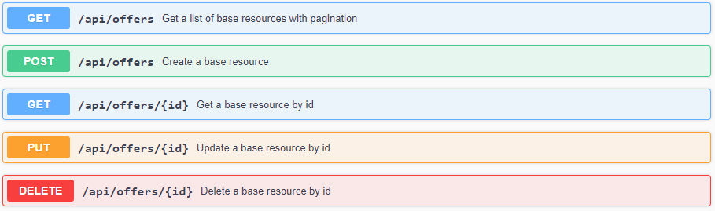
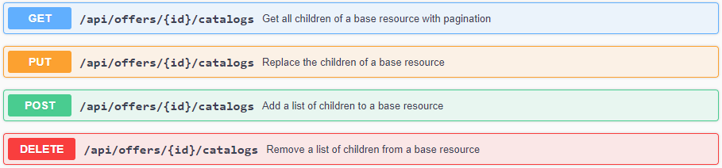
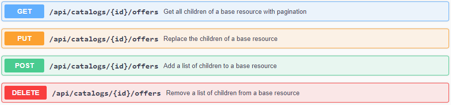
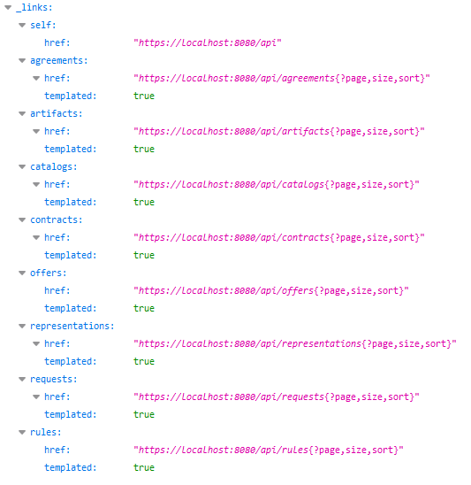
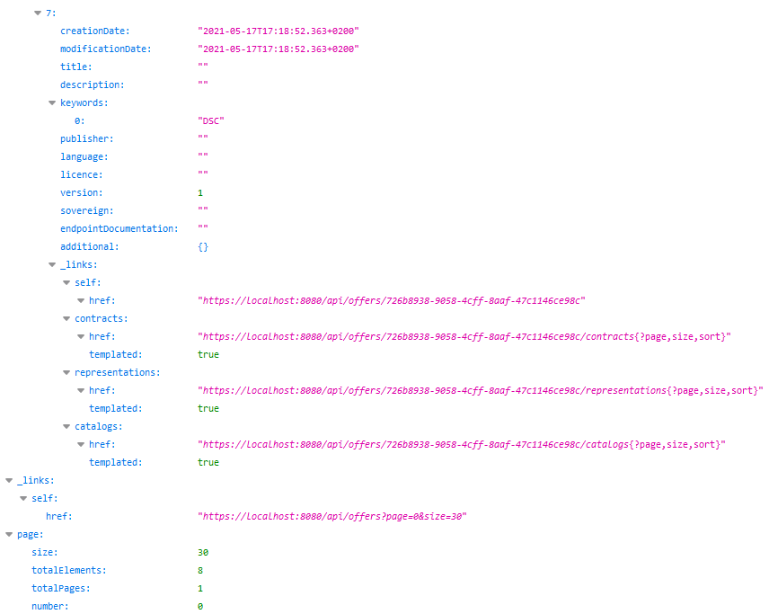

# REST API
{: .fs-9 }

Get to know the Dataspace Connector's REST API to automated resource handling.
{: .fs-6 .fw-300 }

---

If you haven't already checked it out, please first take a look at the Dataspace Connector data
model [here](data-model.md). As mentioned there, the data model of the
Connector is very modular. Relations between objects are predefined and via the REST API, a data
offer can thus be created very dynamically. Individual objects can be detached from each other,
attached to other objects, and modified at any time.

Overview of all available endpoints reduced to generic endpoints:

| Method | Endpoint    | Usage                | Returns   |
| :----- | :---------- | :------------------- | :-----    |
| GET    | /           | Get the connector    | connector |
| POST   | /Ts         | Create a T           | -         |
| GET    | /Ts         | Get a list of all T  | Ts        |
| GET    | /Ts/{id}    | Get a T              | T         |
| PUT    | /Ts/{id}    | Change a T's details | -         |
| DELETE | /Ts/{id}    | Remove a T           | -         |
| GET    | /Ts/{id}/Xs | Get a T's Xs         | Xs        |
| POST   | /Ts/{id}/Xs | Add Xs to the T      | -         |
| PUT    | /Ts/{id}/Xs | Replace Xs of the T  | -         |
| DELETE | /Ts/{id}/Xs | Remove Xs from the T | -         |

CRUD endpoints allow the creation and modification of both individual entities and the relations
between objects - starting from the child and the parent.

Swagger UI for creating offered resources:

Swagger UI for adding offers to catalogs:

Swagger UI for adding offers to catalogs:

As described [here](../../features.md), the Dataspace Connector partly supports HATEOAS and
returns correct response codes according to the HTTP1.1 standard (RFC 7231). The OpenApi
documentation is provided within the repository and can additionally be created at runtime as
explained [here](../../deployment/build.md#maven).

The entry point for the REST API is located at `/api`. From there, you can easily navigate through
the data model.

The API supports pagination and each REST resource provides meta information about
itself. This includes for example the self-link or parent and child information.

