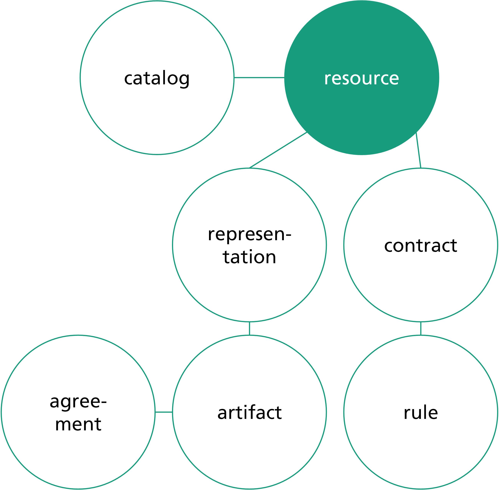

# Data Model
{: .fs-9 }

An explanation of the Dataspace Connector's data model.
{: .fs-6 .fw-300 }

[previous version](../v5/data-model.md)

---

The data model of the Dataspace Connector is based on the structure of the IDS Infomodel. On the top
level, metadata of a data object is called a `resource`. This includes e.g. the title, a description,
license information, and a list of `contract` (offers). Resources are organized by `catalogs`. An IDS
Connector can have multiple catalogs. A resource also has a list of `representations` that describes
the offered data in more detail. This includes e.g. the data type. Below the representation, there
is the `artifact`. This has a 1:1 relation to the raw data and describes e.g. checksum and
bytesize. An artifact then has a reference to (contract) `agreements`, which describe the agreed usage
between data provider and data consumer. Contract offers as `contracts` can contain multiple rules.
Each rule may represent one IDS Usage Control Pattern as described [here](usage-control.md).



Furthermore, the Connector distinguishes between offered and requested resources. If data is offered,
it is called an offered resource. The interfaces allow these resources to be modified and deleted
without any restrictions. If data is requested by a consumer, it is stored as requested resource
after being received. The interfaces for requested resources and contract agreements only allow
interactions and manipulations that do not affect the technical assurance of data sovereignty. Also,
requested resources cannot be registered as such with an IDS broker. Instead, an explicit offer must
be created.

By default, the Dataspace Connector implements a subset of the IDS Infomodel. Some attributes can be
defined via the interfaces, while others are gathered automatically. Each input is checked and empty
inputs have a predefined default value. For a domain specific usage of the Dataspace Connector, each
database entity has an `additional` attributes field that allows storing custom key value pairs
into the database.

An overview of all entities and its attributes are listed in the table below. Between all parent and
child entities n to m relations are provided.

| Entity | Provided Attributes | Automated Attributes | Relations |
|:-------|:-----------|:---------------------|:---------|
| catalog | title, description | created, modified | n offers, n requests|
| offer | title, description, keywords, publisher, sovereign, language, license, endpointDocumentation | version, created, modified | n representations, n contracts, n catalogs |
| request | title, description, keywords, publisher, sovereign, language, license, endpointDocumentation | version, created, modified | n representations, n contracts, n catalogs |
| representation | title, mediaType, language, standard | remoteId, created, modified | n artifacts, n offers/requests |
| artifact | title, accessUrl, username, password | remoteId, remoteAddress, numAccessed, automatedDownload, byteSize, checkSum, created, modified | n representations, n agreements |
| contract | consumer, provider, title, start, end | remoteId, created, modified | n rules, n offers/requests |
| rule | title, value | remoteId, created, modified | n contracts |
| agreement | - | remoteId, confirmed, archived, value, created, modified | n artifacts |

Mapping between the Dataspace Connector's data model and the IDS Infomodel takes place for any IDS
communication. Then, a catalog with offered resources is built from all related objects.

---

**Note**: An offered resource is only complete if it contains at least one contract offer with at
least one rule, and at least one representation with at least one artifact. Otherwise, it will not
be listed in the IDS self-description because there is no complete data offer. In addition, it
should not be missed to link a resource to a catalog.

---

An example IDS catalog could look like that:

```json
{
  "@context":{
    "ids":"https://w3id.org/idsa/core/",
    "idsc":"https://w3id.org/idsa/code/"
  },
  "@type":"ids:ResourceCatalog",
  "@id":"https://localhost:8080/api/catalogs/9ca7ed44-4321-4bd7-8445-b771b5dc3904",
  "ids:offeredResource":[
    {
      "@type":"ids:Resource",
      "@id":"https://localhost:8080/api/offers/726b8938-9058-4cff-8aaf-47c1146ce98c",
      "ids:language":[
        {
          "@id":"idsc:EN"
        }
      ],
      "ids:created":{
        "@value":"2021-05-17T15:18:52.363Z",
        "@type":"http://www.w3.org/2001/XMLSchema#dateTimeStamp"
      },
      "ids:version":"1",
      "ids:description":[
        {
          "@value":"",
          "@language":""
        }
      ],
      "ids:title":[
        {
          "@value":"",
          "@language":""
        }
      ],
      "ids:sovereign":{
        "@id":""
      },
      "ids:publisher":{
        "@id":""
      },
      "ids:representation":[
        {
          "@type":"ids:Representation",
          "@id":"https://localhost:8080/api/representations/9f1fc799-3bbf-4613-9e91-4d9d2f92fa97",
          "ids:instance":[
            {
              "@type":"ids:Artifact",
              "@id":"https://localhost:8080/api/artifacts/688c3e91-461c-4f1f-98e2-e2f7971e8cba",
              "ids:fileName":"",
              "ids:creationDate":{
                "@value":"2021-05-17T15:18:52.749Z",
                "@type":"http://www.w3.org/2001/XMLSchema#dateTimeStamp"
              },
              "ids:byteSize":32,
              "ids:checkSum":"3110206735"
            }
          ],
          "ids:language":{
            "@id":"idsc:EN"
          },
          "ids:created":{
            "@value":"2021-05-17T15:18:52.566Z",
            "@type":"http://www.w3.org/2001/XMLSchema#dateTimeStamp"
          },
          "ids:mediaType":{
            "@type":"ids:IANAMediaType",
            "@id":"https://w3id.org/idsa/autogen/iANAMediaType/7a5c145d-c6e8-48ff-a628-ac99f38f56ec",
            "ids:filenameExtension":""
          },
          "ids:modified":{
            "@value":"2021-05-17T15:18:52.566Z",
            "@type":"http://www.w3.org/2001/XMLSchema#dateTimeStamp"
          },
          "ids:representationStandard":{
            "@id":""
          }
        }
      ],
      "ids:resourceEndpoint":[
        {
          "@type":"ids:ConnectorEndpoint",
          "@id":"https://w3id.org/idsa/autogen/connectorEndpoint/84112ee0-01de-4284-879f-759ab94ade94",
          "ids:endpointDocumentation":[
            {
              "@id":""
            }
          ],
          "ids:accessURL":{
            "@id":"https://localhost:8080/api/offers/726b8938-9058-4cff-8aaf-47c1146ce98c"
          }
        }
      ],
      "ids:contractOffer":[
        {
          "@type":"ids:ContractOffer",
          "@id":"https://localhost:8080/api/contracts/747e6404-178b-4910-b35e-749b0a8057de",
          "ids:permission":[
            {
              "@type":"ids:Permission",
              "@id":"https://localhost:8080/api/rules/0c9e86dc-3453-461c-bdfc-e1fbb3e8ffe5",
              "ids:description":[
                {
                  "@value":"provide-access",
                  "@type":"http://www.w3.org/2001/XMLSchema#string"
                }
              ],
              "ids:title":[
                {
                  "@value":"Example Usage Policy",
                  "@type":"http://www.w3.org/2001/XMLSchema#string"
                }
              ],
              "ids:action":[
                {
                  "@id":"idsc:USE"
                }
              ]
            }
          ],
          "ids:provider":{
            "@id":""
          },
          "ids:consumer":{
            "@id":""
          },
          "ids:contractEnd":{
            "@value":"2021-05-17T15:18:52.906Z",
            "@type":"http://www.w3.org/2001/XMLSchema#dateTimeStamp"
          },
          "ids:obligation":[

          ],
          "ids:prohibition":[

          ],
          "ids:contractDate":{
            "@value":"2021-05-17T17:19:53.749+02:00",
            "@type":"http://www.w3.org/2001/XMLSchema#dateTimeStamp"
          },
          "ids:contractStart":{
            "@value":"2021-05-17T15:18:52.906Z",
            "@type":"http://www.w3.org/2001/XMLSchema#dateTimeStamp"
          }
        }
      ],
      "ids:keyword":[
        {
          "@value":"DSC",
          "@language":""
        }
      ],
      "ids:standardLicense":{
        "@id":""
      },
      "ids:modified":{
        "@value":"2021-05-17T15:18:52.363Z",
        "@type":"http://www.w3.org/2001/XMLSchema#dateTimeStamp"
      }
    }
  ]
}
```
