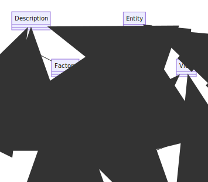

# Diagrams
{: .fs-9 }

Some information about internal data and information flow is visualized in this section.
{: .fs-6 .fw-300 }

---

## Sequence Diagrams

### Consumer Accesses Data with Valid Contract Agreement

### Data Transfer Sequence on Data Access as Owner

### Add a Resource via REST API

## Class Diagrams

### Entity Classes

### Base Entities

### Package "Model" - Core Classes

### Core Classes

### Resource Structure

