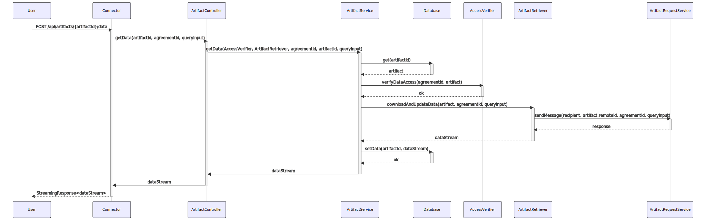
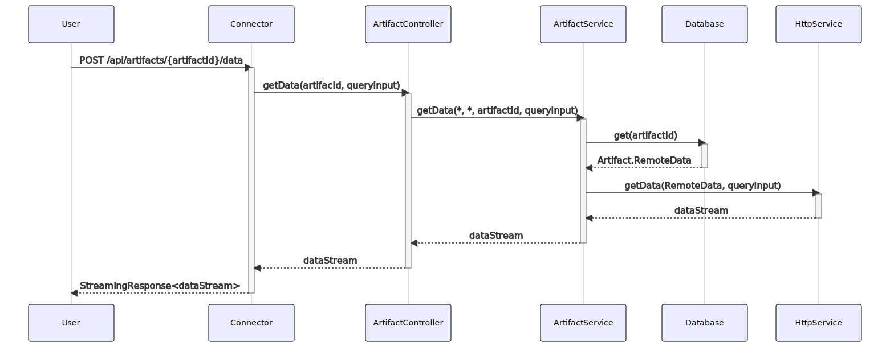
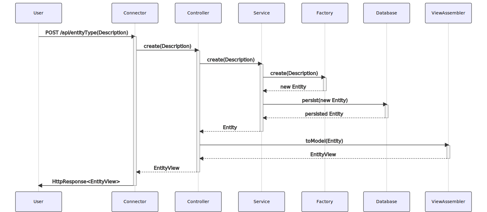

# Sequence Diagrams
{: .fs-9 }

Some information about internal data and information flow is visualized in this section.
{: .fs-6 .fw-300 }

---

## Consumer Accesses Data with Valid Contract Agreement

## Data Transfer Sequence on Data Access as Owner

## Add a Resource via REST API

