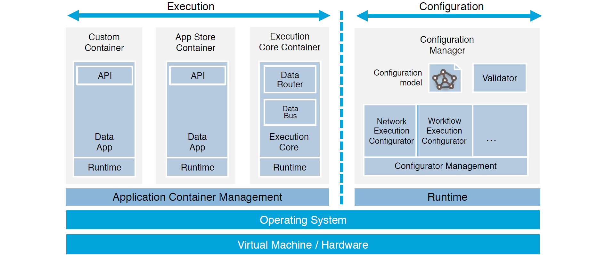

# Introduction
{: .fs-9 }

New to IDS? Get a short introduction and some information about the IDS Connector at a glance.
{: .fs-6 .fw-300 }

---

The IDS Connector is the core of the data space. Is the gateway to connect existing systems and
their data to an IDS ecosystem. Its architecture and functionalities are defined by the IDS
Reference Architecture Model (RAM) and specified by the certification criteria.

The IDS Connector allows to exchange data and enrich it with metadata. An important aspect of this
are usage conditions, which can be defined, administrated, and implemented by the Connector. The
metadata is described by the ontology of the IDS Information Model. The main advantage of the IDS
reference architecture and the use of an IDS Connector is the decentralized data storage. This
enables data integration from different data sources and allows data access exclusively through
other IDS Connectors. Thus, a technical implementation of data sovereignty is guaranteed.

An IDS Connector is composed of various system services:
* Execution core container with message systems (message router/bus)
* Configuration Manager to configure the Connector (execution core container, application container
  management, network, firewalls, etc.)
* Data Apps for data processing and handling
* Application container management
* Hardware/Operating system

Primarily to establish trust, the IDS Connector also addresses Application Container Management,
Network, OS, Hardware, etc. Furthermore, trust between different IDS participants is ensured by
certifying the software components used, i.a. the IDS Connector. Thereby, three different trust
levels are defined: base, trust, and trust+. All profiles comprise IDS-specific requirements and
some from Secure Development and the DIN standard for IT security for industrial automation systems
(DIN EN IEC 62443-4-2). Details are listed [here](roadmap/concept.md).

## Reference Implementation

The Dataspace Connector is one of several implementations of an IDS Connector. It is the reference
implementation of the data economy departement of the Fraunhofer Institute for Software and Systems
Engineering (ISST). It is maintained as an open source software project on GitHub, supported and
promoted by the International Data Spaces Association (IDSA).

In addition to the project, other components are also being developed open source. For example, the
[Dataspace Connector GUI](https://github.com/International-Data-Spaces-Association/DataspaceConnectorUI)
provides a user-friendly interaction with the Connector's REST API. Find more details [here](features.md#libraries).

The Dataspace Connector is designed to provide an easy entry point into the IDS Ecosystem, enabling
projects and companies to connect to data spaces and exchange data in a sovereign way. Thereby, the
defined usage policies are not only transferred between the IDS participants, but also directly
enforced. How the architecture is designed can be seen [here](documentation/v5/architecture.md).

## Links

[IDS Information Model](https://international-data-spaces-association.github.io/InformationModel/docs/index.html) •
[IDS RAM](https://internationaldataspaces.org/use/reference-architecture/) •
[IDSA Jive](https://internationaldataspaces.org/make/communities/) •
[IDS-G](https://github.com/International-Data-Spaces-Association/IDS-G)
